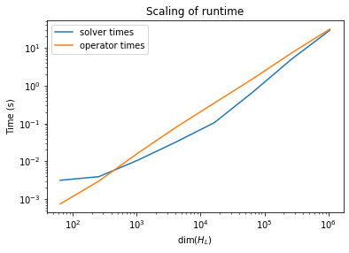

# Appendix

This notebook contains information only tangentially relevant to parts of the 
assignment, but may be useful anyways.

## Runtimes

### TFIM simulations

I was able to run simulations of up to size $L=20$ before my sparse matrix
builder collapsed the kernel while converting lists of matrix elements in COO
format to the CSR representation.
As Brenden suggested, it would faster and less problematic to do this in Fortran
and save the sparse matrix in an intermediate step as a HDF5 dataset before
loading it into numpy, but then if all we cared about was performance we would
just write everything in Fortran.

Here are some summary statistics of the runtimes at various systems sizes,
averaged over the different boundary conditions and values of the parameter $h$.


```python
import numpy as np
from scipy.stats import linregress
import matplotlib.pyplot as plt
%matplotlib inline

from ph121c_lxvm import tfim, data
```


```python
d = data.hdf5.inquire(data.jobs.ARCHIVE)
```

#### Metadata
This is what some of the HDF5 metadata for a job looks like:


```python
d[next(iter(d))]
```


    {'0': {},
     '1': {},
     'L': 20,
     'bc': 'o',
     'h': 1.5,
     'k': 6,
     'oper': 'ph121c_lxvm.tfim.z.H_sparse',
     'opertime': 31.07276510001975,
     'solver': 'scipy.sparse.linalg.eigen.arpack.arpack.eigsh',
     'solvertime': 19.96402716098237,
     'walltime': 51.03679226100212,
     'which': 'BE'}


Here the attributes '0' and '1' refer to datasets within this job.
In this case, '0' contains eigenvalues and '1' contains eigenvectors:
these are just the indices of the tuple returned by the solver.
We also know the system size, the solvers used in this job, and the time
taken for each part of the solver to complete its task.
The names of the jobs themselves are meaningless to people and are just
unique hashes of the job metadata.

#### Complexity

In the following program, we take the metadata and plot the growth of the
runtime average at a given system size, averaging over all other parameter
values: open and closed boundary conditions and 
$h \in \{0.3, 0.5, 0.7, 0.8, 0.85, 0.9, 0.95, 1, 1.05, 1.1, 1.15, 1.2, 1.3, 1.5, 1.7\}$.


```python
# wrangle data from attributes
dset = dict()
for k, v in d.items():
    if str(v['L']) not in dset:
        dset[str(v['L'])] = {
            'solvertime' : [],
            'opertime' : [],
        }
    dset[str(v['L'])]['opertime'].append(v['opertime'])
    dset[str(v['L'])]['solvertime'].append(v['solvertime'])                         
```


```python
# Collect averages for plotting
sizes = []
solvertimes = []
opertimes = []
for L in dset:
    sizes.append(int(L))
    opertimes.append(np.mean(dset[L]['opertime']))
    solvertimes.append(np.mean(dset[L]['solvertime']))
```


```python
# Sort results by L
for i, e in enumerate(sorted(
    zip(sizes, solvertimes, opertimes)
)):
    sizes[i], solvertimes[i], opertimes[i] = e
```


```python
%%capture plot
fig, ax = plt.subplots()

ax.set_title('Scaling of runtime')
ax.set_xlabel('dim($H_L$)')
ax.set_ylabel('Time (s)')

ax.loglog([ 2 ** e for e in sizes ], solvertimes, label='solver times')
ax.loglog([ 2 ** e for e in sizes ], opertimes, label='operator times')
ax.legend()

plt.show()
```

#### Results
The actual runtimes plotted on logarithmic axes are:


```python
plot.show()
```


    

    


Even on logarithmic axis, the runtimes of the eigenvalue solver
`scipy.sparse.linalg.eigsh`, have positive curvature.
This means that the complexity may exceed $\mathcal O (2^{L^\gamma})$ for any
constant $\gamma$.
By comparison, the runtimes of the operator, the function that constructs the
sparse matrix, are essentially linear in log-log space, suggesting that the
complexity of the algorithm is algebraic.
Let's estimate the slope:


```python
m, b, r, p, err = linregress(
    np.log10([ 2 ** e for e in sizes ]),
    np.log10(opertimes),
)
print('slope: ', m)
print('p-val: ', p)
print('stder: ', err)
```

    slope:  1.1040213480877819
    p-val:  6.6717451825543705e-12
    stder:  0.007507917062931846


So the complexity of generating the sparse matrix is very certainly with an
exponent of about 10% larger than linear.

It's also interesting that the operator builds the sparse matrix faster than
ARPACK can diagonalize it for $L \in \{6, 8\}$, but then it is slower until
ARPACK catches up again near $L=20$.

This is not the full story behind these implementations.
Clearly, the fact the operator causes Python to crash at $L=22$ implies
that the memory footprint of that algorithm is unreasonable, though
the runtimes alone do not seem to reveal this as an issue.
To test this, try running the `tfim.z.old_old_H_sparse` function to see
when the code crashes.

Update: I was able to stretch the solver to larger system sizes by rewriting the
code that builds the matrix to reflect the constrained size of the matrix.
That is, there are exactly $(L + 1) 2^L$ elements in the sparse matrix of shape
$(2^L, 2^L)$, and so we can preallocate this number of elements to do things
faster.
Rewriting the COO code in `numpy` (which has since been improved) gave these times:

```python
%time H = tfim.z.H_sparse(22, 1, 'c')

CPU times: user 1min 52s, sys: 2.45 s, total: 1min 55s
Wall time: 1min 55s
    
%time evals = sla.eigsh(H, which='BE', return_eigenvectors=False)

CPU times: user 12min 3s, sys: 15.9 s, total: 12min 19s
Wall time: 2min 4s
```

While it is rather dismal that the sparse matrix takes so long to build in
Python, we do finally observe that the diagonalization routine takes off to
as the system size grows.
To see the speed of current Python implementation, try running this:
(Warning, the last time I tried running this, it caused the Jupyter kernel to crash)


```python
%time tfim.z.old_H_sparse(22, 1, 'c')
```

Newer Update: Since rewriting and optimizing Fortran code called with `f2py`,
I have an implementation that performs $\mathcal O ((L + 1) 2^L)$ assignments
in the case of the z basis.
This is an improvement over the Python code that constructs the sparse matrix,
which I believe uses $\mathcal O (L 2^{L+1})$ assignments.
It's also far better than $\mathcal O (2^{2L})$ from explicitly calculating all
of the matrix elements.
(At this point I think I've exhausted all of the ways of building the matrix.
I've calculated the explicit matrix elements, built the matrix from Kronecker
products, built it in sparse format by exploring all the allowed bit manipulations
on the computational basis, and also used matrix-vector multiplication.
To some extent, in both Python and Fortran.)
I just got these estimates by counting the for loops in the code.
For larger system sizes (those which are limited by the available storage space)
this will probably build the sparse Hamiltonian at breakneck speed.

The current time it takes the most optimal Fortran implementation to construct
the matrix is:


```python
%time tfim.z.H_sparse(22, 1, 'c')
```

    CPU times: user 2.71 s, sys: 3.96 s, total: 6.67 s
    Wall time: 6.69 s


    <4194304x4194304 sparse matrix of type '<class 'numpy.float64'>'
    	with 96468992 stored elements in Compressed Sparse Row format>


### All calculations

These are all the parameter values for which I have calculated wavefunctions
and energies for 6 extremal eigenvalues.

```python
# All values obtained
L = range(8, 21, 2)
h = [0.3, 0.5, 0.7, 0.8, 0.85, 0.9, 0.95, 1, 1.05, 1.1, 1.15, 1.2, 1.3, 1.5, 1.7]
bc = ['o', 'c']
```


```python
results = dict()
for k, v in d.items():
    method = '+'.join([v['oper'], v['solver']])
    if method not in results:
        results[method] = {
            'L' : [],
            'h' : [],
            'bc': [],
        }
    results[method]['L'].append(v['L'])
    results[method]['h'].append(v['h'])
    results[method]['bc'].append(v['bc'])
```


```python

```
