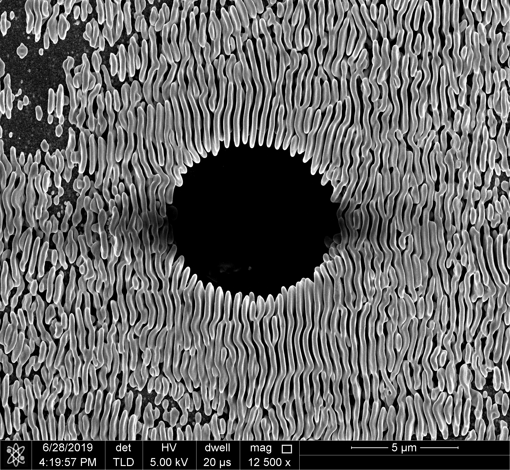
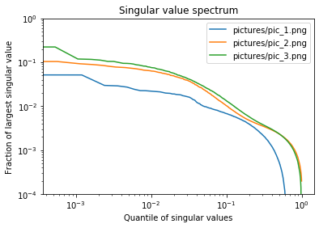
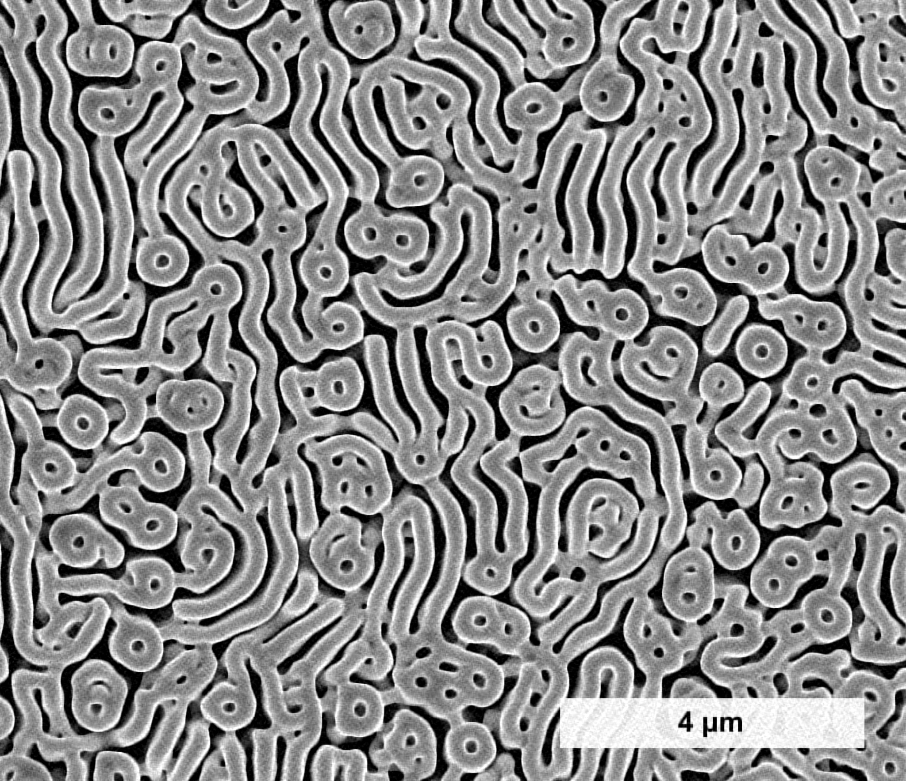
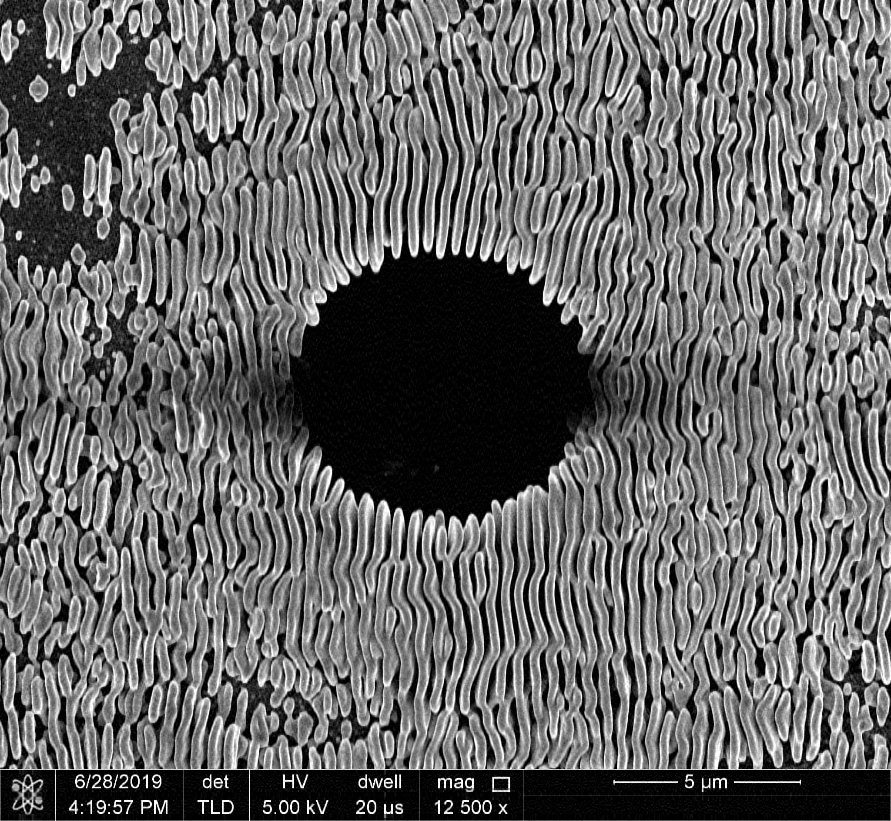

## Part 1: Image compression

### Introduction

I will be studying the singular value decomposition (SVD) of these images:

<div>



</div>

The image on the left is of the assignment.
Henceforth, it is `pic_1.png`.
Because we are doing SVD for this assignment, I thought it would be appropriate
to do SVD on the assignment.
Textual data may also provide a challenge for SVD, because rendering
text well is a nontrivial task.

The two images on the right come from my lab work on Se-Te nanostructures.
These contain lamellar and circular patterns of different feature sizes.
it will be interesting to see how their spectra compare to the text as well
as how the reconstructions at various stages recapture the image quality.
From left to right, these are `pic_2.png` and `pic_3.png`.

### Program

In the section below, we do the following for each image:
- Read it into a grayscale array
- Compute the Frobenius norm of the matrix (to use for comparisons)
- Perform a singular value decomposition (SVD)
- Reconstruct the image from the largest $10^{k+2} \%$ of the singular values
for $k \in \{-1, -2, -3\}$
- Compute the Frobenius distance of the approximation to the original
- Save the reconstructed image

We also:
- Create a plot of the SVD spectrum
- Save computed norms into a data frame


```python
import numpy as np
import pandas as pd
from PIL import Image, ImageOps
import matplotlib.pyplot as plt
%matplotlib inline
```


```python
def name_files(pathname, ext, n=0, out=''):
    """Outputs a generator of numbered strings 'folder/name[_i][_out].ext'"""
    undr = lambda x, y: bool(x) * ('_' + str(y))
    for i in range(n):
        yield ''.join([pathname, undr(n, i+1), undr(out, out), '.', ext])

def svd_rc(u, s, vh, n):
    """Reconstruct matrix using n largest principal values of svd"""
    return u[:, :n] * s[:n] @ vh[:n, :]
```


```python
%%capture plot

pic_path  = 'pictures/pic'
pic_files = name_files(pic_path, 'png', 3)

fig, ax = plt.subplots()

vals_og = { 
    'file' : [],
    'Nval' : [],
    'FroN' : [],
}

vals_rc = { 
    'file' : [],
    'expo' : [],
    'Nrec' : [],
    'FroD' : [],
}

for i, pic_file in enumerate(pic_files):
    # Convert image to grayscale array
    img = Image.open(pic_file)
    img = ImageOps.grayscale(img)
    # Python feature: variables/pointers are not of fixed type
    img = np.asarray(img)
    # SVD of image
    res = np.linalg.svd(img, full_matrices=False)
    # Save total number of singular values and Frobenius norm of original
    vals_og['file'].append(pic_file)
    vals_og['Nval'].append(res[1].size)
    vals_og['FroN'].append(np.linalg.norm(img))
    # Plot spectrum normalized by array size and maximal principal value
    ax.loglog(
        np.arange(res[1].size) / res[1].size, 
        res[1] / np.max(res[1]), 
        label=pic_file,
    )
    for k in range(-3, 0):
        out_file = ''.join([pic_path, '_', str(i+1), '_out_k=', str(k), '.png'])
        # Reconstruct image from SVD with 10 ** k % of principal values
        Npv = int(np.ceil((10 ** k) * res[1].size))
        rec = svd_rc(*res, Npv)
        # Save number of values used in reconstruction and Frobenius distance
        vals_rc['file'].append(pic_file)
        vals_rc['expo'].append(k)
        vals_rc['Nrec'].append(Npv)
        vals_rc['FroD'].append(np.linalg.norm(img - rec))
        # Save reconstruction to file
        rec = Image.fromarray(rec)
        rec = ImageOps.grayscale(rec)
        rec.save(out_file)

df_og = pd.DataFrame(vals_og)
df_rc = pd.DataFrame(vals_rc)
        
ax.set_ylim([1e-4, 1])
ax.set_title('Singular value spectrum')
ax.set_ylabel('Fraction of largest singular value')
ax.set_xlabel('Quantile of singular values')
ax.legend()
plt.show()
```

### Results

#### Spectra

I would first like to look at some features of the original images.


```python
df_og
```


<div>
<style scoped>
    .dataframe tbody tr th:only-of-type {
        vertical-align: middle;
    }

    .dataframe tbody tr th {
        vertical-align: top;
    }

    .dataframe thead th {
        text-align: right;
    }
</style>
<table border="1" class="dataframe">
  <thead>
    <tr style="text-align: right;">
      <th></th>
      <th>file</th>
      <th>Nval</th>
      <th>FroN</th>
    </tr>
  </thead>
  <tbody>
    <tr>
      <th>0</th>
      <td>pictures/pic_1.png</td>
      <td>836</td>
      <td>219990.308432</td>
    </tr>
    <tr>
      <th>1</th>
      <td>pictures/pic_2.png</td>
      <td>1768</td>
      <td>293350.212546</td>
    </tr>
    <tr>
      <th>2</th>
      <td>pictures/pic_3.png</td>
      <td>1887</td>
      <td>250397.226442</td>
    </tr>
  </tbody>
</table>
</div>


For each file, the `Nval` column the number singular of singular values used to
decompose the original image, which is also the largest dimension of the image.
Notably, `pic_1.png` has half as many singular values in the image as the
other pictures because the image has half as many pixels in its largest dimension.
Additionally, the `FroN` column computes the Frobenius norm of the image.
On its own, the value doesn't mean much, but we will use it to normalize
the Frobenius distance of reconstructions to compare for different images.


```python
df_rc['normFroD'] = df_rc.FroD / df_rc.file.replace(
    { e : df_og.FroN[i] for i, e in enumerate(df_og.file) }
)
```

The next thing I would like to study is the plot of the SVD spectra.
Since very few images contain a great deal of high frequency data,
I will use logarithmic scales on the plot to focus on the first, largest
singular values.
Additionally, I will normalize the values by diving the values on each axis
by the largest in each array so that we can compare spectra.


```python
plot()
```


    

    


#### Reconstructions

##### `pic_1.png`

Ordered from not compressed (left) to most compressed (right), the images are:

<div>


</div>

These reconstructions use the following parameters:
- `expo`: The base-ten exponent representing the compression fraction
- `Nrec`: The number of principal singular values used in the reconstruction
- `FroD`: The Frobenius distance of the reconstruction from the original
- `normFroD`: The value of `FroD` divided by `FroN` of the original image


```python
df_rc[df_rc.file == 'pictures/pic_1.png']
```


<div>
<style scoped>
    .dataframe tbody tr th:only-of-type {
        vertical-align: middle;
    }

    .dataframe tbody tr th {
        vertical-align: top;
    }

    .dataframe thead th {
        text-align: right;
    }
</style>
<table border="1" class="dataframe">
  <thead>
    <tr style="text-align: right;">
      <th></th>
      <th>file</th>
      <th>expo</th>
      <th>Nrec</th>
      <th>FroD</th>
      <th>normFroD</th>
    </tr>
  </thead>
  <tbody>
    <tr>
      <th>0</th>
      <td>pictures/pic_1.png</td>
      <td>-3</td>
      <td>1</td>
      <td>32445.117391</td>
      <td>0.147484</td>
    </tr>
    <tr>
      <th>1</th>
      <td>pictures/pic_1.png</td>
      <td>-2</td>
      <td>9</td>
      <td>26717.258393</td>
      <td>0.121447</td>
    </tr>
    <tr>
      <th>2</th>
      <td>pictures/pic_1.png</td>
      <td>-1</td>
      <td>84</td>
      <td>12733.380540</td>
      <td>0.057882</td>
    </tr>
  </tbody>
</table>
</div>


##### `pic_2.png`

Ordered from not compressed (left) to most compressed (right), the images are:

<div>




</div>

These reconstructions use the following parameters:


```python
df_rc[df_rc.file == 'pictures/pic_2.png']
```


<div>
<style scoped>
    .dataframe tbody tr th:only-of-type {
        vertical-align: middle;
    }

    .dataframe tbody tr th {
        vertical-align: top;
    }

    .dataframe thead th {
        text-align: right;
    }
</style>
<table border="1" class="dataframe">
  <thead>
    <tr style="text-align: right;">
      <th></th>
      <th>file</th>
      <th>expo</th>
      <th>Nrec</th>
      <th>FroD</th>
      <th>normFroD</th>
    </tr>
  </thead>
  <tbody>
    <tr>
      <th>3</th>
      <td>pictures/pic_2.png</td>
      <td>-3</td>
      <td>2</td>
      <td>130700.350187</td>
      <td>0.445544</td>
    </tr>
    <tr>
      <th>4</th>
      <td>pictures/pic_2.png</td>
      <td>-2</td>
      <td>18</td>
      <td>104763.350022</td>
      <td>0.357127</td>
    </tr>
    <tr>
      <th>5</th>
      <td>pictures/pic_2.png</td>
      <td>-1</td>
      <td>177</td>
      <td>33092.120611</td>
      <td>0.112808</td>
    </tr>
  </tbody>
</table>
</div>


##### `pic_3.png`

Ordered from not compressed (left) to most compressed (right), the images are:

<div>




</div>

These reconstructions use the following parameters:


```python
df_rc[df_rc.file == 'pictures/pic_3.png']
```


<div>
<style scoped>
    .dataframe tbody tr th:only-of-type {
        vertical-align: middle;
    }

    .dataframe tbody tr th {
        vertical-align: top;
    }

    .dataframe thead th {
        text-align: right;
    }
</style>
<table border="1" class="dataframe">
  <thead>
    <tr style="text-align: right;">
      <th></th>
      <th>file</th>
      <th>expo</th>
      <th>Nrec</th>
      <th>FroD</th>
      <th>normFroD</th>
    </tr>
  </thead>
  <tbody>
    <tr>
      <th>6</th>
      <td>pictures/pic_3.png</td>
      <td>-3</td>
      <td>2</td>
      <td>130085.491407</td>
      <td>0.519517</td>
    </tr>
    <tr>
      <th>7</th>
      <td>pictures/pic_3.png</td>
      <td>-2</td>
      <td>19</td>
      <td>101196.911866</td>
      <td>0.404145</td>
    </tr>
    <tr>
      <th>8</th>
      <td>pictures/pic_3.png</td>
      <td>-1</td>
      <td>189</td>
      <td>32278.979956</td>
      <td>0.128911</td>
    </tr>
  </tbody>
</table>
</div>


### Discussion

#### Spectra

It is interesting that `pic_1.png`, which is very text based, has a spectrum
that decays fastest (we might expect it to struggle with text).
Across all the spectra, it is clear that due to the logarithmic scale, for all
the images, the largest 10% of singular values are in the first thousandth of
all the singular values.
Since the images are less than 2000 pixels each in their largest dimension, this
means that only one or two singular values dominate.

Then it appears there is a gradually sloping region until about between 1 and 10
% of all singular values, which would suggest an informative region, followed by
a dip into another sloping region until after 10%, whereupon all the spectra 
dive down to very small magnitudes.
So my choice of reconstruction based on 0.1%, 1% and 10% of all singular values
seems to capture each of the regions of interest.

Notably, the spectra of `pic_2.png` and `pic_3.png` appear very similar, which
seems reasonable because the images are of very similar quality and morphology.

#### Reconstructions

Starting with `pic_1.png`, we can see that the reconstruction with 1 singular
value is extremely blurry, but at least it captures the lines of text in the 
image.
In the reconstruction with 9 values, it is possible to discern blocks that look
like words, but there is no chance of reading them as the features like serifs
of the font are mangled by linear approximations.
Lastly, the 10% reconstruction appears readable, though of very low quality.
The page is grainy and hard to read for any extended period of time, but the 
text is there and not very different than a low-quality scan of a document,
especially compared with a scanner on a cell phone.

In the reconstruction of `pic_2.png` with 2 singular values, the image looks
like a quilt.
Already with 1% of the values, the reconstruction has recover the 
"spaghetti and cheerios" morphology of the structure, though lacks the detail
and accuracy of the final image.
The 10% reconstruction has lower quality than the original, but is rather close
to the original and would be acceptable.

In the reconstruction of `pic_3.png` with 2 singular values, we again have a
quilt, but can see that the decomposition discerns the big black hole at the
center of the image as well as the presence of the scale bar at the bottom of
the photograph.
We can continue to say similar things as the second image because the features
of the images are quite similar.
On a higher quality close-up of the image, it is interest to look at what
happens inside the "black hole" at the center of the image.
In the full image, it is nearly dark, but in all of the reconstructions, there
is high-frequency noise that sort of imposes the ghostly shadow of the
lamellar pattern in the dark area.
Without the less emphasized singular values, it is impossible to remove the
more subtle defects of the image.

It is also striking to compare the normalized Frobenius distance across the
images.
In general, the errors are nearly a factor of 2 smaller for `pic_1.png` than
`pic_2` or `pic_3`, which are comparable approximations at each level of
reconstruction.
Because I have normalized these errors, I suspect the deviation is not due
to the fact the first pictures has far fewer pixels to approximate, but
because the norm doesn't care so much about the small details in the text.
By comparison, some of the approximations that would be unacceptable for text
are tolerable for the larger-scale patterns in the second and third pictures.


```python

```
