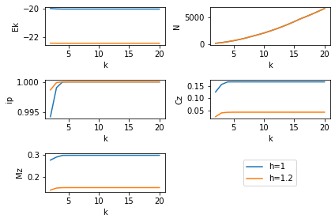
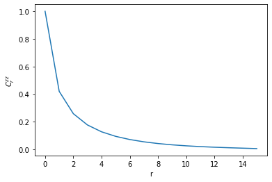

# Matrix product state representation for ground states

$
\require{physics}
\def\bm{\boldsymbol}
$

## Introduction

Clearly, God did not conceive the universe as a point because God would not be
able to take the outer product of two points to obtain vectors.
So in the beginning, there were at least two vectors, and God took the outer
product to make higher order tensors, the inner product to make lower order 
tensors: these were the binary operators on tensors.
God defined these tensors over a field and also used the transpose and inverse.
We believe God may have saved us because God invented index notation 
so that any of this could make sense.
Therefore tensors, their fields, their classes, their algebras, and their calculus
is the only way that it is convenient to express the geometry of the universe.

Sometimes smart people find ways to represent large tensors by smaller tensors,
and this assignment is originated in this observation.
The goal is to rewrite a tensor of dimension $d^L$ which describes the state
of a qu$d$it chain of known $L$ength as a matrix product.
We do so using the SVD and Schmidt decomposition techniques explored earlier.

Other projects seem pretty useful to look into for helpful
[resources](https://tensornetwork.org/) and
[software](https://github.com/google/TensorNetwork).
This is a [useful paper](https://arxiv.org/abs/1008.3477) cited in the
assignment on the subject.

## MPS representation

One asks how you actually do this task efficiently, which comes down to knowing
how to represent the MPS wavefunction in memory.
Choose a positive integer value for $d$ and $L$.
The representation is of the form
$$
    \psi_{\sigma_1, \dots, \sigma_L} = 
        \sum_{\alpha_0, \dots, \alpha_L}
        \left( \prod_{i=0}^{L-1} A_{\alpha_i \alpha_{i+1}}^{\sigma_{i+1}} \right)
$$
where
\begin{align}
    \dim(\alpha_i) \leq 
        \begin{cases}
            d^i
                &\qq{i $\leq$ L/2}
            \\\\
            d^{L-i}
                &\qq{i > L/2}
        \end{cases}
    .
\end{align}
The form of this dimensionality is due to the way the mps representation is 
constructed: a tensor is reshaped and has its SVD taken many times,
each new time after another reshaping and SVD.
Essentially these dimensions are the maximal ranks of a matrix as it is reshaped
from $(1, d^L)$ to $(d^L, 1)$ when exchanging rows to columns $d$ at a time.
Now an approximation scheme for MPS is a map:
\begin{align}
    r(i) : \{i\} \to \{1, \dots, \max(1, \min(d r(i-1), \dim(\alpha_i))\}
\end{align}
with $r(0) = 1$
that specifies the number of rows retained at each bond index.
This is a finite but large function space, and of the many approximation schemes
it often makes sense to choose a simple one, such as
$r(i) = \min(\chi, \dim(\alpha_i))$ for constant $\chi$.

### Scaling

The scaling of storage requirements as a function of the approximation scheme
can be calculated succinctly as $d \sum_i r(i) r(i+1)$.
Taking $r=\dim(\alpha_i)$ makes for an inefficient full representation of the
because of the $d^L$ scaling for the individual matrices.
For what truncation ranks $r$ is MPS an efficient storage scheme?
We will test the accuracy of the scheme later.

## Program

- $d=2, r=\chi=1$ ($r=1$ is a special case where the storage format can be optimized)
- For $h \in \{ 1, 5/4 \}$
- Take the ground state in the open system at large L
- Compute the MPS approximation of the wavefunction, varying the bond length $k$
- Calculate the actual reduction in storage space (np.size)
- Contract the indices of the tensors of MPS to obtain exponentially large
$\ket{\tilde{\psi}_{gs} (k)}$.
- Compute the overlap $\braket{\tilde{\psi}\_{gs} (k)}{\psi\_{gs}}$

### Efficient calculations with MPS

- Use MPS to calculate
$E(k) = \ev{H}{\tilde{\psi}\_{gs} (k)} / \braket{\tilde{\psi}\_{gs} (k)}$
- Compute the same correlation functions as in Assignment 1 at both values of 
the order parameter and study the convergence in $k$.


```python
from itertools import product 

import numpy as np
import pandas as pd
import scipy.sparse.linalg as sla
import matplotlib.pyplot as plt
%matplotlib inline

from ph121c_lxvm import basis, tfim, tests, tensor, data
```


```python
%%time
measurements = {
    'bc': [],
    'L' : [],
    'h' : [],
    'k' : [],
    'N' : [],
    'nm': [],
    'E' : [],
    'Ek': [],
    'ip': [],
    'Cz': [],
    'Mz': [],
}

for oper_params in tests.tfim_sweep(
    L = [16],
    h = [1, 1.2],
    bc= ['o'],
):
    job = dict(
        oper=tfim.z.H_sparse,
        oper_params=oper_params,
        solver=sla.eigsh,
        solver_params={ 
            'k' : 6, 
            'which' : 'BE',
        },
    )
    evals, evecs = data.jobs.obtain(**job)
    
    # construct local operators
    sx = np.array([[0, 1], [1, 0]], dtype='float64')
    sz = np.array([[1, 0], [0, -1]], dtype='float64')
        
    C = tensor.mpo(oper_params['L'], d=2)
    C[0] = sz
    C[oper_params['L'] // 2] = sz
    
    # Construct operators which are sums of local operators
    # (sums of mpos are not always mpos)
    H = []
    M = []
    
    # Hamiltonian
    ## z terms
    for i in range(oper_params['L'] - 1 + (oper_params['bc'] == 'c')):
        H.append(tensor.mpo(oper_params['L'], d=2))
        H[-1][i] = -sz
        H[-1][(i+1) % oper_params['L']] = sz
    ## x terms
    for i in range(oper_params['L']):
        H.append(tensor.mpo(oper_params['L'], d=2))
        H[-1][i] = -oper_params['h'] * sx
        
    # Magnetization
    for i, j in product(np.arange(oper_params['L']), repeat=2):
        M.append(tensor.mpo(oper_params['L'], d=2))
        M[-1][i] = sz / (oper_params['L'] ** 2)
        M[-1][j] = sz
    
    # Do the MPS
    chi_max = 20
    rank = tensor.bond_rank(chi_max, oper_params['L'], d=2)
    A = tensor.mps(evecs[:, 0], rank, L=oper_params['L'], d=2)

    for i in range(chi_max - 1):
        rank = tensor.bond_rank(chi_max - i, oper_params['L'], d=2)
        A.lower_rank(rank)
        measurements['bc'].append(
            oper_params['bc']
        )
        measurements['L'].append(
            oper_params['L']
        )
        measurements['h'].append(
            oper_params['h']
        )
        measurements['k'].append(
            chi_max - i
        )
        measurements['N'].append(
            A.size()
        )
        measurements['nm'].append(
            A.inner(A)
        )
        measurements['E'].append(
            evals[0]
        )
        measurements['ip'].append(
            np.inner(A.v, A.contract_bonds()) / np.sqrt(measurements['nm'][-1])
        )
        measurements['Ek'].append(
            sum(A.expval(e) for e in H) / measurements['nm'][-1]
        )
        measurements['Cz'].append(
            A.expval(C) / measurements['nm'][-1]
        )
        measurements['Mz'].append(
            sum(A.expval(e) for e in M) / measurements['nm'][-1]
        )
        
df = pd.DataFrame(measurements)
```

    CPU times: user 8min 5s, sys: 1.24 s, total: 8min 6s
    Wall time: 7min 25s


```python
%%capture plot
# make the k saturation plots
myplots = ['Ek', 'N', 'ip', 'Cz', 'Mz']
ncol = 2
nrow = len(myplots) // 2 + len(myplots) % 2

fig, axes = plt.subplots(nrow, ncol)

for i, row in enumerate(axes):
    for j, ax in enumerate(row):
        if (ncol * i + j) < len(myplots):
            for h in [1, 1.2]:
                ax.plot(
                    df[df.h == h]['k'].values,
                    df[df.h == h][myplots[i * ncol + j]].values,
                    label='h=' + str(h),
                )
            ax.set_xlabel('k')
            ax.set_ylabel(myplots[i * ncol + j])
            handles, labels = ax.get_legend_handles_labels()
        else:
            ax.set_axis_off()
            ax.legend(handles, labels, loc='center')
    fig.tight_layout()
```


```python
%%capture corr
# Make the long-range correlation plots
rank = tensor.bond_rank(chi_max, oper_params['L'], d=2)
A = tensor.mps(evecs[:, 0], rank, L=oper_params['L'], d=2)

C = np.empty(oper_params['L'], dtype='object')
x = [0]
y = [1]
C[0] = sz
for i in range(1, oper_params['L']):
    C[i] = sz
    x.append(i)
    y.append(A.expval(C) / measurements['nm'][-1])
    C[i] = None
fig, ax = plt.subplots()
ax.plot(x, y)
ax.set_xlabel('r')
ax.set_ylabel('$C^{zz}_r$')
plt.show()
```

## Results

### Accuracy

I first wanted to show some of the numerical results in decimal form so that
I have an opportunity to explain my abbreviations, and to show that the
calculations are relatively accurate.
The table below shows how several calculated quanties vary as a function of $k$,
The quantities of interest are $N$, the actual number of coefficients stored in
the mps approximation, $E_k$, the MPS expectation value of the energy of the 
ground state MPS wavefunction, $nm$, the norm of the wavefunction, $ip$, the
overlap of the ground state vector with the MPS wavefunction after contracting
its virtual indices, $C^{zz}$, the two-point spin correlation function measured
at a distance of $L/2$, and $M^{zz}$, which is the normalized expected value
of the magnetization of the chain.
These values are:


```python
df.tail()
```


<div>
<style scoped>
    .dataframe tbody tr th:only-of-type {
        vertical-align: middle;
    }

    .dataframe tbody tr th {
        vertical-align: top;
    }

    .dataframe thead th {
        text-align: right;
    }
</style>
<table border="1" class="dataframe">
  <thead>
    <tr style="text-align: right;">
      <th></th>
      <th>bc</th>
      <th>L</th>
      <th>h</th>
      <th>k</th>
      <th>N</th>
      <th>nm</th>
      <th>E</th>
      <th>Ek</th>
      <th>ip</th>
      <th>Cz</th>
      <th>Mz</th>
    </tr>
  </thead>
  <tbody>
    <tr>
      <th>33</th>
      <td>o</td>
      <td>16</td>
      <td>1.2</td>
      <td>6</td>
      <td>856</td>
      <td>1.000000</td>
      <td>-22.464998</td>
      <td>-22.464998</td>
      <td>1.000000</td>
      <td>0.042561</td>
      <td>0.151028</td>
    </tr>
    <tr>
      <th>34</th>
      <td>o</td>
      <td>16</td>
      <td>1.2</td>
      <td>5</td>
      <td>620</td>
      <td>1.000000</td>
      <td>-22.464998</td>
      <td>-22.464995</td>
      <td>1.000000</td>
      <td>0.042531</td>
      <td>0.151009</td>
    </tr>
    <tr>
      <th>35</th>
      <td>o</td>
      <td>16</td>
      <td>1.2</td>
      <td>4</td>
      <td>424</td>
      <td>0.999995</td>
      <td>-22.464998</td>
      <td>-22.464974</td>
      <td>0.999997</td>
      <td>0.042135</td>
      <td>0.150831</td>
    </tr>
    <tr>
      <th>36</th>
      <td>o</td>
      <td>16</td>
      <td>1.2</td>
      <td>3</td>
      <td>248</td>
      <td>0.999784</td>
      <td>-22.464998</td>
      <td>-22.463383</td>
      <td>0.999892</td>
      <td>0.039861</td>
      <td>0.149105</td>
    </tr>
    <tr>
      <th>37</th>
      <td>o</td>
      <td>16</td>
      <td>1.2</td>
      <td>2</td>
      <td>120</td>
      <td>0.997312</td>
      <td>-22.464998</td>
      <td>-22.453767</td>
      <td>0.998689</td>
      <td>0.024050</td>
      <td>0.139941</td>
    </tr>
  </tbody>
</table>
</div>


When $k=2$, the MPS values are correct to within 0.1% of the original, such
as by comparing $E$, the exact diagonalization energy, with $E_k$, or the norm
with the expected value of 1.
However, the values appear to saturate as $k$ grows and already at $k=4$ it
appears though some of the quantites are the same as $k=5$ with the 8 or so
digits we can see.
In particular, we see that the MPS ground state energy decreases towards the
minimal exact value as the quality of approximation improves.

## Saturation of bond dimension

We can visualize some of these values to get a wider look at the dependence on
$k$.


```python
plot.show()
```


    

    


It appears that the values have all saturated long before reaching the maximum
bond dimension of $k=20$ -- already it seems that at $k=5$ there won't be
noticeable changes in any quantity, except for $N$ which is the rapidly-growing
storage requirement (compare this to $2^{16} = 65,536$ coefficients in the
dense vector representation of the wavefunction).
Across two different values of $h$, at the critical value and in the paramagnetic
phase (the paramagnetic effect is stronger for a larger system size such as 
this one, $L=16$), we observe the same physics as in the first assignment.
The values of the correlation functions are two to three times higher for $h=1$
than in the transverse-field dominated $h=1.2$ regime.
In addition, due to this value of $h$, the ground state energy is lower for
larger $h$, as observed last time, due to the influence of the aligning effect
of the field.

### Verifying long-range correlations

Another thing to verify is not only $C^{zz}$ at the half-way point in the chain,
but correlation as a function of all distances at the chain.
I repeated this measurement from the first assignment in the MPS representation,
using the reference spin as the left boundary and measuring the $z$ spin
correlation with the rest of the chain.
The plot below, at $L=16$ and $h=1.2$ and open boundary conditions, shows how
the correlations decay exponentially with the distance due to the strong effect
of the transverse terms in the TFIM Hamiltonian in the paramagnetic phase.


```python
corr.show()
```


    

    


## Discussion

We have implemented a functional MPS representation that allows for a massive
reduction in storage space ($k=5$ corresponds to 620 coefficients versus 
65,536 in the dense wavefunction at $L=16$).
This was possible because the Hamiltonian of this system is 2-local and
with open boundary conditions, which curb the entanglement entropy of the system
so that we can truncate the smallest Schmidt values to good approximation at
each step in the MPS representation.
In particular, this is true for very few states, those with an area law for the
entanglement entropy, such as the ground state and most excited state.

My implementation of mps is practical and has been tested for qudit systems
for $d=3, 4$ in the `ph121c_lxvm.tests.tensor` module.
Ultimately, if we consider translation invariant systems, we should test
that the order in which we do MPS in the chain does not affect the results.
I think with my current code on permutations in the `ph121c_lxvm.basis` module
makes this possible by adding one line of code that I have commented in the
`__init__` method for the `tensor.mps` class.
However, that permutation code only works for $d=2$, so I'd have to put some
thought into what algorithm can be used for larger $d$ because we lose the
convenience of binary to some extent.

## Testing the ceiling

I will do one last test to see the feasibility/runtime of the MPS scheme at
$L=20$ with the bond dimension of $k=20$, while also calculating the expected
energy of the state, at all truncations of $k$ from 1 to 5.
The idea is to see whether the larger system size poses difficulties on the
runtime or the accuracy of the approximation scheme.


```python
%%time
for oper_params in tests.tfim_sweep(
    L = [20],
    h = [1],
    bc= ['o'],
):
    job = dict(
        oper=tfim.z.H_sparse,
        oper_params=oper_params,
        solver=sla.eigsh,
        solver_params={ 
            'k' : 6, 
            'which' : 'BE',
        },
    )
    evals, evecs = data.jobs.obtain(**job)
    
    # construct local operators
    sx = np.array([[0, 1], [1, 0]], dtype='float64')
    sz = np.array([[1, 0], [0, -1]], dtype='float64')
    
    # Construct operators which are sums of local operators
    # (sums of mpos are not always mpos)
    H = []
    
    # Hamiltonian
    ## z terms
    for i in range(oper_params['L'] - 1 + (oper_params['bc'] == 'c')):
        H.append(tensor.mpo(oper_params['L'], d=2))
        H[-1][i] = -sz
        H[-1][(i+1) % oper_params['L']] = sz
    ## x terms
    for i in range(oper_params['L']):
        H.append(tensor.mpo(oper_params['L'], d=2))
        H[-1][i] = -oper_params['h'] * sx
        
    # Do the MPS
    chi_max = 20
    rank = tensor.bond_rank(chi_max, oper_params['L'], d=2)
    A = tensor.mps(evecs[:, 0], rank, L=oper_params['L'], d=2)
    
    print(
        'L=', oper_params['L'],
        'h=', oper_params['h'],
        'bc=', oper_params['bc'],
    )
    print(f'GS energy (ED, N={A.v.size}):', evals[0])
    
    for i in range(chi_max - 1):
        rank = tensor.bond_rank(chi_max - i, oper_params['L'], d=2)
        A.lower_rank(rank)
        print(
            f'GS energy (k={chi_max - i}, N={A.size()}):',
            sum(A.expval(e) for e in H) / A.inner(A),
        )
```

    L= 20 h= 1 bc= o
    GS energy (ED, N=1048576): -25.107797111623707
    GS energy (k=20, N=9960): -25.107797111623768
    GS energy (k=19, N=9116): -25.10779711162373
    GS energy (k=18, N=8312): -25.10779711162367
    GS energy (k=17, N=7548): -25.107797111623395
    GS energy (k=16, N=6824): -25.107797111622258
    GS energy (k=15, N=6048): -25.10779711162034
    GS energy (k=14, N=5320): -25.10779711161205
    GS energy (k=13, N=4640): -25.107797111536886
    GS energy (k=12, N=4008): -25.10779711113673
    GS energy (k=11, N=3424): -25.10779711084674
    GS energy (k=10, N=2888): -25.107797109071836
    GS energy (k=9, N=2400): -25.107796991932208
    GS energy (k=8, N=1960): -25.10779672401916
    GS energy (k=7, N=1524): -25.107796334675882
    GS energy (k=6, N=1144): -25.10779522504112
    GS energy (k=5, N=820): -25.107721356074386
    GS energy (k=4, N=552): -25.107495385020844
    GS energy (k=3, N=320): -25.088852485114337
    GS energy (k=2, N=152): -25.037706037740858
    CPU times: user 5.02 s, sys: 35.7 ms, total: 5.06 s
    Wall time: 3.15 s


Wow, that series of operations is really trivial, and the compression ratio is
really fantastic!
In contrast, what takes a long time is contracting the virtual indices
in all $2^L$ possible ways, even when $k=2$ (as it is here):


```python
%time np.inner(A.v, A.contract_bonds())
```

    CPU times: user 3min 21s, sys: 1.87 s, total: 3min 23s
    Wall time: 3min 20s

    0.9799687081812974


I was wondering why the first program took so long -- clearly because of this
exponentially-scaling operation to calculate the overlap, whereas the polynomial
tensor network contractions were much faster.
The overlap is within 2% at $k=2$, which is amazing, but to actually calculate
this on a regular basis would be unfeasible ... unless I write it in Fortran :).
For fun, what happens with $k=1$?
This would be the case of classical physics, where each spin is assigned a 
probability of being up or down, and the probability of the whole system 
being in a given spin configuration is just the product of probabilities at 
each site.

```python
rank = tensor.bond_rank(1, oper_params['L'], d=2)
A.lower_rank(rank)
%time np.inner(A.v, A.contract_bonds())
```

    CPU times: user 3min 3s, sys: 1.59 s, total: 3min 4s
    Wall time: 3min 2s

    0.16368954570087002


Not a good approximation anymore!
In this case, the storage requirement is just $2L$:


```python
A.size()
```


    40


```python

```
