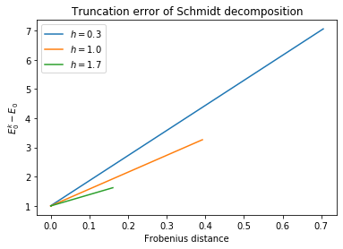

# Truncation error of Schmidt decomposition

## Introduction

This time, at the ground state we are interested in open boundary conditions
and performing the Schmidt decomposition at the middle of the chain.
We also want to compute approximate ground states and identify the errors
of these approximations.

## Program

- Schmidt decomposition at the middle of the chain ($\ell = L/2$)
- Truncate the state at various ranks from 1 to $2^{L/2}$
- For each approximation, calculate the Frobenius distance and the error in the
ground state energy relative to the ground state energy from diagonalization


```python
import numpy as np
import pandas as pd
import scipy.sparse.linalg as sla
import matplotlib.pyplot as plt
%matplotlib inline

from ph121c_lxvm import tfim, basis, tests, data
```


```python
%%time
errors = {
    'k' : [], 
    'h' : [],
    'F' : [],
    'E' : [],
}
L = 20
l = 10
bc = 'o'
for oper_params in tests.tfim_sweep(
    L = [L],
    h = [0.3, 1, 1.7],
    bc= [bc],
):
    job = dict(
        oper=tfim.z.H_sparse,
        oper_params=oper_params,
        solver=sla.eigsh,
        solver_params={ 
            'k' : 6, 
            'which' : 'BE',
        },
    )
    evals, evecs = data.jobs.obtain(**job)
    
    M = basis.schmidt.matricize(evecs[:, 0], np.arange(l), L)
    res = np.linalg.svd(M, full_matrices=False)
    for k in range(1, 2 ** (L // 2) + 1, 100):
        M_rc = basis.schmidt.svd_rc(*res, k)
        v_rc = basis.schmidt.vectorize(M_rc, list(range(l)), L)
        errors['k'].append(k)
        errors['h'].append(oper_params['h'])
        errors['F'].append(np.linalg.norm(M - M_rc))
        errors['E'].append(
            np.inner(v_rc, tfim.z.H_vec(v_rc, **oper_params)) 
            / np.linalg.norm(v_rc) - evals[0]
        )
df = pd.DataFrame(errors)
```

    CPU times: user 23.7 s, sys: 375 ms, total: 24.1 s
    Wall time: 4.12 s


```python
%%capture plot
h = sorted(set(df.h))
fig, ax = plt.subplots()
for s in h:
    ax.plot(df.F[df.h==s].values, df.E[df.h==s].values, label='$h=$'+str(s))
ax.set_title('Truncation error of Schmidt decomposition')
ax.set_xlabel('Frobenius distance')
ax.set_ylabel('$E_0^k - E_0$')
ax.legend()
plt.show()
```

## Results

Let's take a look at the ratio of the two error metrics:


```python
plot.show()
```


    

    


It appears that for any $h$, the relationship between the two errors is linear.
For larger values of $h$, the Frobenius distance grows faster than the energy
gap in the truncation of the ground state, $\Delta E(k) = E_0^k - E_0$.

## Discussion

Based on the plot, $\Delta E(k) > 0$, indicating that truncations never
attain the minimum energy of the Hamiltonian (barring some possible degeneracies).
We might want to use this error relation to bound the approximation error
of schemes like MPS.


```python

```
