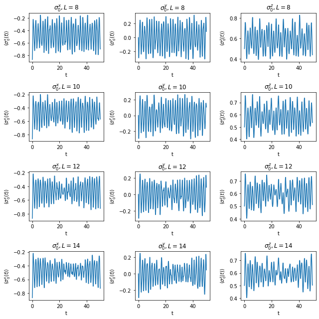
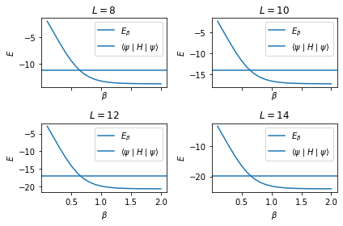
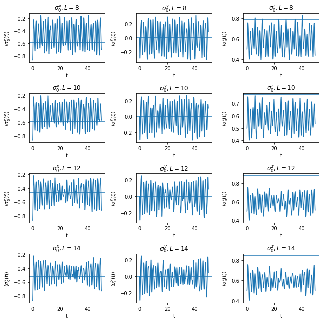
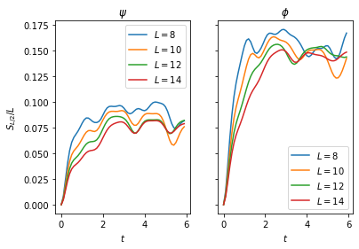

# Dynamical ETH

$
\require{physics}
\def\bm{\boldsymbol}
\def\indx{\sigma_1, \dots, \sigma_L}
\def\ind{\tau_1, \dots, \tau_L}
$


```python
import numpy as np
import pandas as pd
from scipy import optimize
import matplotlib.pyplot as plt
%matplotlib inline

from ph121c_lxvm import models, data, tests, measure, tensor, basis
```

The model we will study in this notebook is:
$$
    H = \sum_{j=1}^L \sigma_j^z \sigma_{j+1}^z
    - h^x \sum_{j=1}^L \sigma_j^x
    - h^z \sum_{j=1}^L \sigma_j^z 
    .
$$
We are interested in the fact that $h^z \neq 0$ makes this
TFIM Hamiltonian non-integrable, and creates eigenstate thermalization.
We set the following generic parameter values:


```python
hx, hz = (-1.05, 0.5)
```

## Time evolution of an initial state

Our initial state will be
$$
    \ket{\psi (t=0)} = \ket{\xi}_1 \otimes \cdots \otimes \ket{\xi}_L
    ,
$$
with $\ket{\xi} = \frac{1}{2} \left( \ket{\uparrow} - \sqrt{3} \ket{\downarrow}\right)$.
It is a translation-invariant state because


```python
xi = np.array([-np.sqrt(3), 1]) * 0.5
```

### Goal

We are interested in time-evolving this state, which we can do in the energy
eigenbasis, where:
$$
    \ket{\psi} 
        = \sum_{\indx=0}^{1} a_{\indx} \ket{\indx} 
        = \sum_{n=1}^{2^L} c_n \ket{n}
    ,
$$
where $c_n = \sum_{\indx} a_n \braket{n}{\indx}$.
For brevity, let us replace the index $\indx$ of the computational basis with $i$,
which we think of as a binary number.
The time evolution of an operator in the energy basis, where
$H \ket{n} = \epsilon_n \ket{n}$, can be described by:
$$
    \ev{O}{\psi(t)} 
        = \sum_{n, m} c_m^* c_n e^{-i(\epsilon_n - \epsilon_m)t} \mel{m}{O}{n}
    .
$$

Shu Fay told me it took hours to run code to do this, so I decided I would
think about how to cast the problem efficiently.
We could represent the sum above as the sum of the entries of a matrix in the
energy basis, where initially each element is $c_m^* c_n \mel{m}{O}{n}$ and
we update this at each time step of duration $\Delta t$ by multiplying with
$e^{-i(\epsilon_n - \epsilon_m)\Delta t}$. We would find that each time step
incurs $2^{2L}$ multiplications followed by summing $2^{2L}$ elements together.
This is a fine way of doing the problem.

I wanted to use the fact we know the Pauli operators very well in the computational
basis. In fact, we know that they have precisely $2^L$ nonzero elements, and we
can calculate these elements with bitwise operations. We can use resolution of
the identity to write:
\begin{align}
    \ev{O}{\psi(t)} 
        &= \sum_{i=0}^{2^L-1} \sum_{j=0}^{2^L-1} \sum_{n, m}
        c_m^* c_n e^{-i(\epsilon_n - \epsilon_m)t}
        \braket{m}{\indx}\mel{i}{O}{j}\braket{j}{n}
    \\\\
        &= \sum_{i=0}^{2^L-1} \sum_{j=0}^{2^L-1} \mel{i}{O}{j}
        \left( \sum_{n} c_n e^{-i\epsilon_n t} \braket{j}{n} \right)
        \left( \sum_{m} c_m e^{-i\epsilon_m t} \braket{i}{m} \right)^*
    .
\end{align}
For $O = \sigma_k^\mu$ where $k \in \{1, \dots, L \}$ and $\mu \in {x, y, z}$,
we have binary formulas acting on site $k, k-1, k+1$ that give us the matrix
elements $\mel{i}{O}{j}$. In fact, we know $j$ to be a function of
$i$, so we will write $j(i) = i$.
Therefore we have succesfully eliminated one of the indices:
\begin{align}
    \ev{O}{\psi(t)} 
        &= \sum_{i} \mel{i}{O}{j(i)}
        \left( \sum_{n} c_n e^{-i\epsilon_n t} \braket{j(i)}{n} \right)
        \left( \sum_{m} c_m e^{-i\epsilon_m t} \braket{i}{m} \right)^*
    .
\end{align}
This means that when $j(i) = i$ which is true for diagonal operators
such as $\sigma_k^z$, we can also limit the complexity of the problem to $2^{2L}$
sums and multiplications, without ever having to change basis.
Note that in this case, $\braket{i}{m}$ is just a matrix element of one of
the eigenvectors returned by the diagonalization routine.

### Implementation

I wrote code to do this time evolution in Fortran, and basically it does a loop
over the physical index and the inner indices are just sums over vectors.
I used OpenMP directives to speed the loop over the $\indx$ index in my Fortran
code which cut the runtime in half compared to the serial version. 4 threads fastest.

In short, time evolution on a temporal grid is a computationally intensive task.
I expect this to take a long time to run, so I will make sure to save the results.
After all, it did take me 4 tries before `np.linalg.eigh` didn't get itself
killed due to requesting too much memory at $L=14$. When it did work, then
$L=14$ took about 10 minutes to diagonalize (`numpy` says it uses the `syevd`
routine from LAPACK, but back in assignment 1, I used the generic `syev` routine
from MKL LAPACK and $L=14$ only took 2 minutes there).
All of the diagonalization runtime information lives in the metadata of my HDF5
archive, but I'm too slow to get it out. All I know is that my appendix to
assignment 2 demonstrates the code to talk with the archive.


```python
%%time

dt = 0.05
Nstp = 1000
bc = 'c'

save = '../../data/wobbles.pick'

try:
    df = pd.read_pickle(save)
except FileNotFoundError:

    wobbles = {
        'Pauli' : [],
        'vals' : [],
        'L' : [],
    }

    for L in [8, 10, 12, 14]:

        job = dict(
            oper=models.tfim_z.H_dense,
            oper_params={
                'L' : L,
                'h' : hx,
                'hz': hz,
                'bc': bc,
            },
            solver=np.linalg.eigh,
            solver_params={},
        )
        evals, evecs = data.jobs.obtain(**job)
        # Build initial state
        psi = 1
        for i in range(L):
            psi = np.kron(xi, psi)
        # Decompose in energy basis
        coef = evecs.T @ psi
        # Measure 1-site Pauli observables
        for which in ['x', 'y', 'z']:
            cevecs = (coef * evecs).T.astype('complex')
            tevals = np.exp(-1j*dt*evals)
            wobbles['L'].append(L)
            wobbles['Pauli'].append(which)
            wobbles['vals'].append(
                measure.evolve.Pauli_ev(
                    L=L, Nstp=Nstp, which=which, cevecs=cevecs, tevals=tevals,
                    num_threads=4
                )
            )

    df = pd.DataFrame(wobbles)
    df.to_pickle(save)
```

    CPU times: user 2.96 ms, sys: 0 ns, total: 2.96 ms
    Wall time: 5.13 ms


### Fast time, slow time

I think I've been here for about 30 minutes, so let's just say that's the time
it took to generate all 12 time evolutions (The diagonalization was done previously).

In this case, I ran the code in three separate chunks, and the last runtime was
for $L=14$ and `which = 'y'`:

```
CPU times: user 1h 41min 23s, sys: 11.4 s, total: 1h 41min 35s
Wall time: 8min 41s
```

Of that time, $L=12$ took about 30-40 seconds each, so every $L=14$ evolution
took about 10 minutes.

Update: after tuning threads, the same code ran faster:

```
CPU times: user 22min 25s, sys: 931 ms, total: 22min 26s
Wall time: 5min 36s
```
I wish I did it right the first time!


### Results

Let's display how these expectation values evolve in time, as a function of $L$
and the operator. All the data were iterated 1000 steps at a step size of 0.05.


```python
nrow = 4
ncol = 3
fig, axes = plt.subplots(nrow, ncol)
for i, row in enumerate(axes):
    for j, ax in enumerate(row):
        ax.plot(np.arange(Nstp)*dt, df.vals[i*ncol + j])
        ax.set_title(f"$\sigma_0^{df['Pauli'][i*ncol + j]}, L={df.L[i*ncol + j]}$")
        ax.set_xlabel('t')
        ax.set_ylabel(f"$\\langle \sigma_0^{df['Pauli'][i*ncol + j]} (t) \\rangle$")
fig.set_size_inches(9, 9)
fig.tight_layout()
plt.show()
```


    

    


It is interesting to see how as $L$ grows, the expectation values appear to 
contract in the amplitude of oscillation near $t=30$. At longer times, these
values appear to grow again, as though some large-scale interference pattern
manifests itself across the system.
The presence of this slight contraction is a signature of the thermalization
of this expectation value at large $L$. While the amplitude at low $L$ appears
constant throughout the observation period, the larger system offers more states
over which the exponentials that propagate the solution in time can decohere,
leading to greater reductions in oscillation amplitude.

## Thermal values of observables

Let's dive into canonical ensemble:


```python
%%time

zzz = lambda x: np.exp(-x * evals)
zz  = lambda x: sum(evals * zzz(x))
z   = lambda x: sum(zzz(x))

bc = 'c'

graphs = [8, 10, 12, 14]
energies = []
roots = []
betas = np.arange(20) * .1 + .1

nrow = 2
ncol = 2

fig, axes = plt.subplots(nrow, ncol, sharex=True)

for i, row in enumerate(axes):
    for j, ax in enumerate(row):
        job = dict(
            oper=models.tfim_z.H_dense,
            oper_params={
                'L' : graphs[i*ncol + j],
                'h' : hx,
                'hz': hz,
                'bc': bc,
            },
            solver=np.linalg.eigh,
            solver_params={},
        )
        evals, _ = data.jobs.obtain(**job)
        # Build inital state
        psi = 1
        for _ in range(graphs[i*ncol + j]):
            psi = np.kron(xi, psi)
        assert np.allclose(np.linalg.norm(psi), 1)
        energies.append(
            np.inner(psi, models.tfim_z.H_vec(psi, graphs[i*ncol + j], hx, bc, hz))
        )
        # Plot beta vs energy
        ax.plot(
            betas, [ zz(e) / z(e) for e in betas ],
            label=f'$E_\\beta$',
        )
        ax.axhline(
            y=energies[-1], xmin=0, xmax=max(betas),
           label='$\\langle \\psi \\mid H \\mid \\psi \\rangle$'
        )
        ax.set_title(f'$L={graphs[i*ncol + j]}$')
        ax.set_xlabel('$ \\beta $')
        ax.set_ylabel('$E$')
        ax.legend()
        # Find which beta gives energy of psi
        roots.append(
            optimize.root_scalar(
                lambda x: zz(x) / z(x) - energies[-1],
                bracket=[0.1, 1], method='brentq'
            ).root
        )
fig.tight_layout()
plt.show()
```


    

    


    CPU times: user 1.9 s, sys: 977 ms, total: 2.88 s
    Wall time: 3.5 s


We found the inverse temperature corresponding to the energy of $\ket{\psi}$
at various values of $L$ with `scipy's` rootfinder:


```python
from pprint import pprint
print('L,     beta,             Energy')
pprint(list(zip(graphs, roots, energies)))
```

    L,     beta,             Energy
    [(8, 0.6467790651478237, -11.274613391789277),
     (10, 0.6468465654548882, -14.0932667397366),
     (12, 0.6468575448662777, -16.911920087683917),
     (14, 0.6468593322518154, -19.73057343563123)]


Let's now build the thermal state with this energy and measure the observables
in this time-independent state. We'll have to compute the observables
$O \in \{\sigma_0^x, \sigma_0^y, \sigma_0^z\}$ in the energy basis or vice versa.


```python
!ulimit -s unlimited
```


```python
%%time

observe = dict(x=[], y=[], z=[])

for i, L in enumerate(graphs):
    job = dict(
        oper=models.tfim_z.H_dense,
        oper_params={
            'L' : L,
            'h' : hx,
            'hz': hz,
            'bc': bc,
        },
        solver=np.linalg.eigh,
        solver_params={},
    )
    evals, evecs = data.jobs.obtain(**job)
    therm = np.exp(-roots[i] * evals)
    therm = therm / sum(therm)
    # Normalize!
    therm = therm / np.linalg.norm(therm)
    
    for which in ['x', 'y', 'z']:
        cevecs = (therm * evecs).T.astype('complex')
        tevals = np.zeros(2 ** L, dtype='complex')
        observe[which].append(
            measure.evolve.Pauli_ev(
                L=L, Nstp=1, which=which, cevecs=cevecs, tevals=tevals,
                num_threads=4
            )
        )

```

    CPU times: user 8.84 s, sys: 8.49 s, total: 17.3 s
    Wall time: 11 s


It makes me happy I can use my Fortran code more than once!

With values in hand we make the same plot as before to compare the stationary
and thermalizing values:


```python
nrow = 4
ncol = 3
opers = ['x', 'y', 'z']
fig, axes = plt.subplots(nrow, ncol)
for i, row in enumerate(axes):
    for j, ax in enumerate(row):
        ax.plot(np.arange(Nstp)*dt, df.vals[i*ncol + j])
        ax.axhline(observe[opers[j]][i])
        ax.set_title(
            f"$\sigma_0^{df['Pauli'][i*ncol + j]}, L={df.L[i*ncol + j]}$"
        )
        ax.set_xlabel('t')
        ax.set_ylabel(
            f"$\\langle \sigma_0^{df['Pauli'][i*ncol + j]} (t) \\rangle$"
        )
fig.set_size_inches(9, 9)
fig.tight_layout()
plt.show()
```


    

    


The plots each display the thermal value as a horizontal line against the time-
dependent trace.
While $\sigma^y$ remains zero in the thermal state, because a purely real
state will vanish in expectation under this traceless and skew-symmetric operator,
we do observe that $\sigma^x$ remains close to its thermal value just as soon
as it relaxes after a dozen oscillations.
On the other hand, it seems like $\sigma^z$ undershoots its thermal value
by about 25% for the observation period. It seems like the thermal value I
calculated is larger than the $h^z = 0.5$ parameter, which is unlikely to
produce the large correlations I'm predicting. Let's agree that I made some
mistake somewhere, or that the translation invariant state just is unable
to access so high a correlation.

At least for $\sigma^x$ and $\sigma^y$ we can see that for larger $L$, the
time-dependent value narrows onto the thermal value faster.

## Entanglement entropy growth with time

Let's propagate $\ket{\psi}$ as well as another another product state:
$$
    \ket{\phi} = \ket{\omega}_1 \otimes \cdots \otimes \ket{\omega}_L
        \qquad \ket{\omega} = \frac{1}{\sqrt{e^2 + \pi^2}}
        \left( e \ket{\uparrow} - \pi \ket{\downarrow} \right)
$$
where $e$ is Euler's number.
We'll propagate this state in time directly and measure the half-system
entanglement entropy.


```python
%%time

om = np.array([-np.pi, np.e]) / np.sqrt(np.e ** 2 + np.pi ** 2)

entropx = dict(L=[], t=[], psi=[], phi=[])

dt = 0.1
Nstp = 60

for i, L in enumerate(graphs):
    job = dict(
        oper=models.tfim_z.H_dense,
        oper_params={
            'L' : L,
            'h' : hx,
            'hz': hz,
            'bc': bc,
        },
        solver=np.linalg.eigh,
        solver_params={},
    )
    evals, evecs = data.jobs.obtain(**job)
    tevals = np.exp(-1j * evals * dt)
    # Build inital state
    psi = 1
    phi = 1
    for _ in range(L):
        psi = np.kron(xi, psi)
        phi = np.kron(om, phi)
    assert np.allclose(np.linalg.norm(psi), 1)
    assert np.allclose(np.linalg.norm(phi), 1)
    # change to energy basis
    psi = evecs.T @ psi
    phi = evecs.T @ phi
    for j in range(Nstp):
        # measure
        entropx['L'].append(L)
        entropx['t'].append(j*dt)
        entropx['psi'].append(
            measure.entropy.entanglement(basis.schmidt.values(
                    evecs @ psi, np.arange(L // 2), L
                ))
        )
        entropx['phi'].append(
            measure.entropy.entanglement(basis.schmidt.values(
                    evecs @ phi, np.arange(L // 2), L
                ))
        )
        # propagate
        psi = tevals * psi
        phi = tevals * phi
    
df = pd.DataFrame(entropx)
```

    CPU times: user 3min 14s, sys: 1min 12s, total: 4min 27s
    Wall time: 2min 1s


```python
fig, axes = plt.subplots(1, 2, sharey=True)
for i, L in enumerate(graphs):
    # psi
    axes[0].plot(
        df.t[df.L == L].values,
        df.psi[df.L == L].values / L,
        label=f'$L={L}$'
    )
    axes[0].set_title('$\\psi$')
    axes[0].set_xlabel('$t$')
    axes[0].set_ylabel('$S_{L/2}/L$')
    axes[0].legend()
    # phi
    axes[1].plot(
        df.t[df.L == L].values,
        df.phi[df.L == L].values / L,
        label=f'$L={L}$'
    )
    axes[1].set_title('$\\phi$')
    axes[1].set_xlabel('$t$')
    axes[1].legend()
```


    

    


Indeed, no accidents here. Both states show increasing entanglement entropy
over time, which when normalized by the system length leads to a fairly
interesting set of characteristic curves.
Since all the curves don't quite collapse onto each, we conclude that, the entropy
isn't some scale-invariant quantity, though all the normalized entropies are 
in the same region and show similar dynamics.

However, we do have to notice that the the entropy of $\ket{\phi}$ is twice as
large as that of $\ket{\psi}$. Perhaps this is due to the transcendental choice
of coefficients.

At early times, the product state has no entanglement entropy, but as time goes
on, the entropy increases rapidly until it plateaus.
Interestingly, in this plateau region, the entropy dips with some periodicity.
A scar state, maybe?

In short, lots of entropy means we won't be able to use MPS for these states.


```python

```
