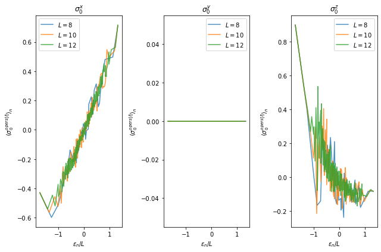
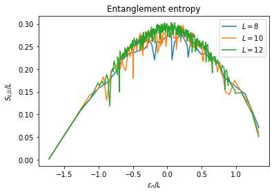

# Eigenstate ETH

$\require{physics}$


```python
import numpy as np
import pandas as pd
import matplotlib.pyplot as plt
%matplotlib inline

from ph121c_lxvm import data, models, basis, tensor, measure
```

## Observables in excited states

We are going to measure the expectation values of the Pauli operators in the
energy eigenbasis. And we are going to _plot_ them. Same Hamiltonian as last time.

Here we are supposed to use the fact $\ket{\xi}$ from last time is translation
invariant, so we'll restrict to the $k=0$ momentum sector of the Hamiltonian
by filtering states in the wrong sector with $\ev{T}{n} \neq 1$.


```python
%%time

hx, hz = (-1.05, 0.5)
bc = 'c'
sizes = [8, 10, 12]#, 14] # kernel crashes at 14: maybe raise stack limit?
opers = ['x', 'y', 'z']
values = {
    'Pauli' : [],
    'vals' : [],
    'L' : [],
    'E' : [],
    'n' : [],
}
sector = { str(e): [] for e in sizes }

for L in sizes:

    job = dict(
        oper=models.tfim_z.H_dense,
        oper_params={
            'L' : L,
            'h' : hx,
            'hz': hz,
            'bc': bc,
        },
        solver=np.linalg.eigh,
        solver_params={},
    )
    evals, evecs = data.jobs.obtain(**job)
    # cyclic permutation by translation operator
    perm = np.arange(L)
    perm += 1
    perm[-1] = 0
    # identify vectors in k=0 sector
    for i in range(evals.size):
        if np.allclose(np.inner(evecs[:, i], 
            basis.schmidt.permute(evecs[:, i], [], L, perm=perm)
        ), 1):
            sector[str(L)].append(i)
    # Now calculate expectation values
    for which in opers:
        for i in sector[str(L)]:
            tevals = np.zeros(2 ** L, dtype='complex')
            tevals[i] = 1
            cevecs = (tevals * evecs).T.astype('complex')
            values['vals'].append(
                measure.evolve.Pauli_ev(
                    L=L, Nstp=1, which=which, cevecs=cevecs, tevals=tevals,
                    num_threads=4
                )
            )
            values['L'].append(L)
            values['n'].append(i)
            values['E'].append(evals[i])
            values['Pauli'].append(which)
df = pd.DataFrame(values)
```

    CPU times: user 9min 36s, sys: 51.3 s, total: 10min 28s
    Wall time: 2min 38s


```python
fig, axes = plt.subplots(1, len(opers))
for i, ax in enumerate(axes):
    for L in sizes:
        ax.plot(
            df[(df.L == L) & (df.Pauli == opers[i])].E.values / L,
            df[(df.L == L) & (df.Pauli == opers[i])].vals.values,
            label=f'$L={L}$', alpha=0.8
        )
    ax.set_title(f'$\\sigma_0^{opers[i]}$')
    ax.set_xlabel('$\\epsilon_n / L$')
    ax.set_ylabel('$\\langle \\sigma_0^{opers[i]} \\rangle_n$')
    ax.legend()
fig.set_size_inches(9, 6)
fig.tight_layout()
```


    

    


If I reason too much about these plots, my brain might pop, but we can describe
some of what is going on. In the $\sigma^z$ plot, higher energies correspond
to less magnetic correlation of the first spin, while near the ground state
the first site is much more likely to point up to align with the parallel
and interaction terms in the Hamiltonian. As before $\sigma^y$ vanishes, and
so $\sigma^x$ remains, and it simply grows with the energy, almost equal and
opposite $\sigma^z$, as the higher energy states are aligning with the transverse
field.

In general, as a function of $L$, it appears that all the expectation values
don't change with $L$ in this data. I think I can see that the yellow
is noisier than the green, so maybe the variance is decreasing as $L$ increases.
From ETH behavior, we would expect that larger systems thermalize faster, and
that the expectation values become more predictable.

## Entropic signature of thermalization

Let's also get the half-system entanglement entropy of the $k=0$ momentum
eigenstates:


```python
entropx = dict(L=[], S=[], E=[], n=[])

for L in sizes:

    job = dict(
        oper=models.tfim_z.H_dense,
        oper_params={
            'L' : L,
            'h' : hx,
            'hz': hz,
            'bc': bc,
        },
        solver=np.linalg.eigh,
        solver_params={},
    )
    evals, evecs = data.jobs.obtain(**job)
    for i in sector[str(L)]:
        entropx['L'].append(L)
        entropx['n'].append(i)
        entropx['E'].append(evals[i])
        entropx['S'].append(
            measure.entropy.entanglement(basis.schmidt.values(
                evecs[:, i], np.arange(L // 2), L
            ))
        )
        
df = pd.DataFrame(entropx)
```


```python
fig, ax = plt.subplots()
for L in sizes:
    ax.plot(df[df.L == L].E.values / L, df[df.L == L].S.values / L, label=f'$L={L}$')
ax.set_title('Entanglement entropy')
ax.set_xlabel('$\\epsilon_n / L$')
ax.set_ylabel('$S_{L/2} / L$')
ax.legend()
plt.show()
```


    

    


It appears that the entropy is minimized at the band edges and maximized in the
center of the spectrum in the $k=0$ momentum sector.
Also, the entropy, which we have normalized by the system size no longer appears
to depend strongly on $L$, so we have found something more or less scale invariant.
I believe this graphic is consistent with our exploration of area law and volume
law scaling of the entanglement entropy.


```python

```
