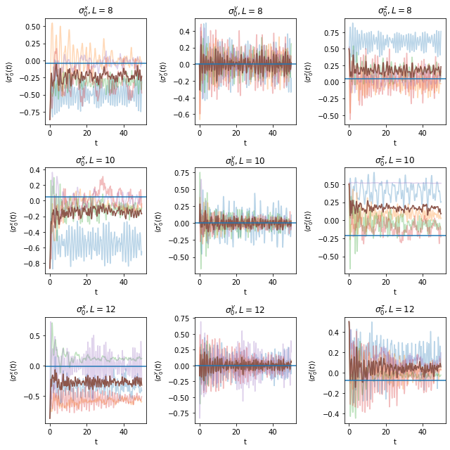
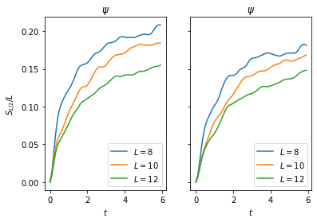
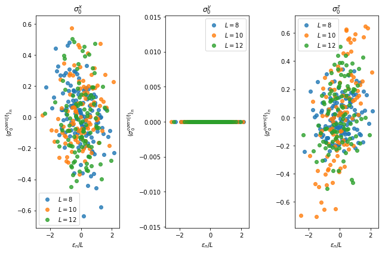
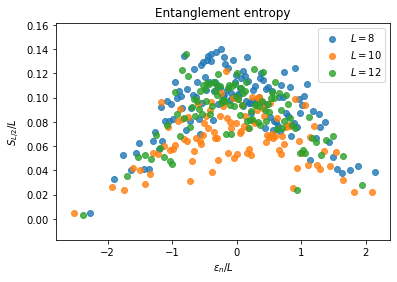
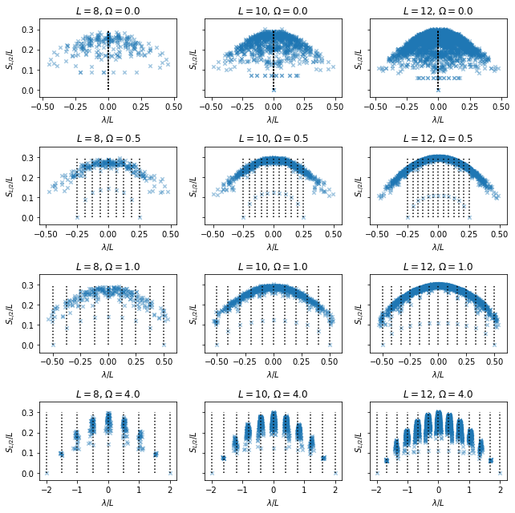

# Violations of ETH

$
\require{physics}
\def\bm{\boldsymbol}
$


```python
from itertools import product

import numpy as np
import pandas as pd
from scipy import optimize
import matplotlib.pyplot as plt
%matplotlib inline

from ph121c_lxvm import models, data, basis, measure
```

## Many-body localized model

We introduce disorder to the model we have used before by allowing random
coefficients:
$$
    H = \sum_{j=1}^L \sigma_j^z \sigma_{j+1}^z
    - \sum_{j=1}^L h_j^x \sigma_j^x
    - \sum_{j=1}^L h_j^z \sigma_j^z 
    .
$$
The random coefficients $h_j^x$ and $h_j^z$ are sampled uniformly from $[W, W]$,
where the magnitude of $W$ determines the strength of the random noise.
This model may introduce localization of the quantum state, where the random
noise causes the probability mass to focus on some sites in the chain.

### Repeating dynamical ETH experiments

Here we're just going to repeat a lot of the code from before to create the
same graphics


```python
%%time
# Def variables and time evolve expectation values
save = '../../data/randoms.pick'
xi = np.array([-np.sqrt(3), 1]) * 0.5    
dt = 0.05
Nstp = 1000
W = 3.0
Navg = 5
bc = 'c'
opers = ['x', 'y', 'z']
graphs = [8, 10, 12]


try:
    df = pd.read_pickle(save)
except FileNotFoundError:
    
    randoms = {
        'Pauli' : [],
        'vals' : [],
        'L' : [],
        'i' : [],
    }

    
    rng = np.random.default_rng(seed=935)

    for L in graphs:
        psi = 1
        for i in range(L):
            psi = np.kron(xi, psi)
        for i in range(Navg):
            job = dict(
                oper=models.tfim_z.H_dense,
                oper_params={
                    'L' : L,
                    'h' : rng.uniform(low=-W, high=W, size=L),
                    'hz': rng.uniform(low=-W, high=W, size=L),
                    'bc': bc,
                },
                solver=np.linalg.eigh,
                solver_params={},
            )
            evals, evecs = data.jobs.obtain(**job)

            coef = evecs.T @ psi
            for which in opers:
                cevecs = (coef * evecs).T.astype('complex')
                tevals = np.exp(-1j*dt*evals)
                randoms['L'].append(L)
                randoms['i'].append(i)
                randoms['Pauli'].append(which)
                randoms['vals'].append(
                    measure.evolve.Pauli_ev(
                        L=L, Nstp=Nstp, which=which, cevecs=cevecs, tevals=tevals,
                        num_threads=4
                    )
                )

    df = pd.DataFrame(randoms)
    df.to_pickle(save)
```

    CPU times: user 3.22 ms, sys: 0 ns, total: 3.22 ms
    Wall time: 4.67 ms


The original run time was:
```
CPU times: user 1h 36min 47s, sys: 16 s, total: 1h 37min 3s
Wall time: 8min 25s
```


```python
%%time
# Here we repeat the calculations to get the thermal values
zzz = lambda x: np.exp(-x * evals)
zz  = lambda x: sum(evals * zzz(x))
z   = lambda x: sum(zzz(x))

energies = []
roots = []
observe = dict(x=[], y=[], z=[])

nrow = 2
ncol = 2

rng = np.random.default_rng(seed=935)

for L in graphs:
    for i in range(Navg):
        hx = rng.uniform(low=-W, high=W, size=L)
        hz = rng.uniform(low=-W, high=W, size=L)
        job = dict(
            oper=models.tfim_z.H_dense,
            oper_params={
                'L' : L,
                'h' : hx,
                'hz': hz,
                'bc': bc,
            },
            solver=np.linalg.eigh,
            solver_params={},
        )
        evals, evecs = data.jobs.obtain(**job)
        # Build inital state
        psi = 1
        for _ in range(L):
            psi = np.kron(xi, psi)
        assert np.allclose(np.linalg.norm(psi), 1)
        energies.append(
            np.inner(psi, models.tfim_z.H_vec(psi, L, hx, bc, hz))
        )
        # Find which beta gives energy of psi
        roots.append(
            optimize.root_scalar(
                lambda x: zz(x) / z(x) + abs(energies[-1]),
                bracket=[1e-5, 10], method='brentq'
            ).root
        )
        # Build thermal state
        therm = np.exp(-roots[-1] * evals)
        therm = therm / sum(therm)
        # Normalize!
        therm = therm / np.linalg.norm(therm)
        # Calculate expectation values
        for which in opers:
            cevecs = (therm * evecs).T.astype('complex')
            tevals = np.zeros(2 ** L, dtype='complex')
            observe[which].append(
                measure.evolve.Pauli_ev(
                    L=L, Nstp=1, which=which, cevecs=cevecs, tevals=tevals,
                    num_threads=4
                )
            )
```

    CPU times: user 7.13 s, sys: 823 ms, total: 7.95 s
    Wall time: 2.21 s


```python
nrow = len(graphs)
ncol = len(opers)
fig, axes = plt.subplots(nrow, ncol)
for i, row in enumerate(axes):
    for j, ax in enumerate(row):
        for k in range(Navg):
            ax.plot(
                np.arange(Nstp)*dt,
                df[(df.Pauli == opers[j]) & (df.L == graphs[i]) & (df.i == k)
                ].vals.values[0], alpha=0.3
            )
        ax.plot(
            np.arange(Nstp)*dt,
            np.mean(df[(df.Pauli == opers[j]) & (df.L == graphs[i])].vals.values)
        )
        ax.axhline(np.mean(observe[opers[j]][i*Navg:(i+1)*Navg]))
        ax.set_title(f"$\sigma_0^{opers[j]}, L={graphs[i]}$")
        ax.set_xlabel('t')
        ax.set_ylabel(f"$\\langle \sigma_0^{opers[j]} (t) \\rangle$")
fig.set_size_inches(9, 9)
fig.tight_layout()
plt.show()
```


    

    


There are 5 realizations of the noise. It looks pretty to see all of them dancing
about unitarily. Most of them seem to be converging to the same value, especially
$\sigma^z$ for larger $L$, though it seems like some of the realizations are
happy doing their own thing.

The plot displays all of the realizations as translucent traces, whereas the
solid brown trace is the average of all the traces.
The horizontal line is the average of the thermal expectation values over the
realizations.

I'm pretty sure I've made some mistakes leading to discrepancies between the
long-time value of the two solid lines.
I ran into an issue which I tried to patch: the issue was that some of the
states had positive energy expectation values, so I couldn't solve for the
inverse temperature because those energies are strictly negative.
My patch was to flip the sign.

Alas!

### Half-chain entanglement entropy ... again

Same two states as the previous part


```python
%%time

om = np.array([-np.pi, np.e]) / np.sqrt(np.e ** 2 + np.pi ** 2)

entropx = dict(L=[], t=[], psi=[], phi=[], i=[])

dt = 0.1
Nstp = 60

rng = np.random.default_rng(seed=935)

for L in graphs:
    for i in range(Navg):
        hx = rng.uniform(low=-W, high=W, size=L)
        hz = rng.uniform(low=-W, high=W, size=L)
        job = dict(
            oper=models.tfim_z.H_dense,
            oper_params={
                'L' : L,
                'h' : hx,
                'hz': hz,
                'bc': bc,
            },
            solver=np.linalg.eigh,
            solver_params={},
        )
        evals, evecs = data.jobs.obtain(**job)
        tevals = np.exp(-1j * evals * dt)
        # Build inital state
        psi = 1
        phi = 1
        for _ in range(L):
            psi = np.kron(xi, psi)
            phi = np.kron(om, phi)
        assert np.allclose(np.linalg.norm(psi), 1)
        assert np.allclose(np.linalg.norm(phi), 1)
        # change to energy basis
        psi = evecs.T @ psi
        phi = evecs.T @ phi
        for j in range(Nstp):
            # measure
            entropx['L'].append(L)
            entropx['t'].append(j*dt)
            entropx['i'].append(i)
            entropx['psi'].append(
                measure.entropy.entanglement(basis.schmidt.values(
                        evecs @ psi, np.arange(L // 2), L
                    ))
            )
            entropx['phi'].append(
                measure.entropy.entanglement(basis.schmidt.values(
                        evecs @ phi, np.arange(L // 2), L
                    ))
            )
            # propagate
            psi = tevals * psi
            phi = tevals * phi

    df = pd.DataFrame(entropx)
```

    CPU times: user 1min 41s, sys: 13.6 s, total: 1min 55s
    Wall time: 29 s


```python
fig, axes = plt.subplots(1, 2, sharey=True)
grp = df.groupby(['L', 't']).mean().reset_index()
for i, L in enumerate(graphs):
    for j, which in enumerate(['phi', 'psi']):
        # psi
        axes[j].plot(
            grp[grp.L == L].t.values,
            grp[grp.L == L][which].values / L,
            label=f'$L={L}$'
        )
        axes[j].set_title('$\\psi$')
        axes[j].set_xlabel('$t$')
        axes[j].legend()
axes[0].set_ylabel('$S_{L/2}/L$')
plt.show()
```


    

    


As usual, the entropy is increasing with time.
Here we've averaged over the realizations of the Hamiltonian.
Bad idea to use MPS, but who knows?

### Eigenstate ETH again

Let's observe the features of the same observables in the energy basis.
I checked that there were no momentum sectors too. Instead we should do the calculation for some meaningfull subset of the eigenvectors.


```python
%%time

bc = 'c'
sizes = [8, 10, 12]
opers = ['x', 'y', 'z']
values = {
    'Pauli' : [],
    'vals' : [],
    'L' : [],
    'E' : [],
    'n' : [],
    'k' : [],
}
entropx = dict(L=[], S=[], E=[], n=[], k=[])

rng = np.random.default_rng(seed=935)

for L in sizes:
    for k in range(Navg):
        hx = rng.uniform(low=-W, high=W, size=L)
        hz = rng.uniform(low=-W, high=W, size=L)
        job = dict(
            oper=models.tfim_z.H_dense,
            oper_params={
                'L' : L,
                'h' : hx,
                'hz': hz,
                'bc': bc,
            },
            solver=np.linalg.eigh,
            solver_params={},
        )
        evals, evecs = data.jobs.obtain(**job)

        # Now calculate expectation values
        for i, _ in enumerate(evals):
            # only look at 100 eigenstates to save time
            if i % (evals.size // 100) == 0:
                for which in opers:
                    tevals = np.zeros(2 ** L, dtype='complex')
                    tevals[i] = 1
                    cevecs = (tevals * evecs).T.astype('complex')
                    values['vals'].append(
                        measure.evolve.Pauli_ev(
                            L=L, Nstp=1, which=which, cevecs=cevecs, tevals=tevals,
                            num_threads=4
                        )[0]
                    )
                    values['k'].append(k)
                    values['L'].append(L)
                    values['n'].append(i)
                    values['E'].append(evals[i])
                    values['Pauli'].append(which)
                entropx['k'].append(k)
                entropx['L'].append(L)
                entropx['n'].append(i)
                entropx['E'].append(evals[i])
                entropx['S'].append(
                    measure.entropy.entanglement(basis.schmidt.values(
                        evecs[:, i], np.arange(L // 2), L
                    ))
                )
df = pd.DataFrame(values)
dg = pd.DataFrame(entropx)
```


```python
fig, axes = plt.subplots(1, len(opers))
grp = df.groupby(['L', 'n', 'Pauli']).mean().reset_index()
for i, ax in enumerate(axes):
    for L in sizes:
        ax.scatter(
            grp[(grp.L == L) & (grp.Pauli == opers[i])].E.values / L,
            grp[(grp.L == L) & (grp.Pauli == opers[i])].vals.values,
            label=f'$L={L}$', alpha=0.8,
        )
    ax.set_title(f'$\\sigma_0^{opers[i]}$')
    ax.set_xlabel('$\\epsilon_n / L$')
    ax.set_ylabel('$\\langle \\sigma_0^{opers[i]} \\rangle_n$')
    ax.legend()
fig.set_size_inches(9, 6)
fig.tight_layout()
```


    

    


This data is much noisier than the eigenstate ETH Hamiltonian.
It appears the there is much less correlation with energy
in these expectation values of the eigenstates.
In addition, the dependence on $L$ is unclear.
For $\sigma^z$, it appear that $L=10$ has a larger
range than the others.
I only obtained data points for 100 eigenstates, and each data point is an average over 5 realizations.


```python
fig, ax = plt.subplots()
grp = dg.groupby(['L', 'n']).mean().reset_index()
for L in sizes:
    ax.scatter(
        grp[grp.L == L].E.values / L,
        grp[grp.L == L].S.values / L,
        label=f'$L={L}$', alpha=0.8
    )
ax.set_title('Entanglement entropy')
ax.set_xlabel('$\\epsilon_n / L$')
ax.set_ylabel('$S_{L/2} / L$')
ax.legend()
plt.show()
```


    

    


Here we can see that the entanglement entropies, averaged over 5 realizations, appear to separate,
with some overlap, as a function of $L$.
The same concave down pattern is observed as with the
eigenstate ETH experiments, but the magnitude of the
maximum is less by a factor of 2.
However, this MBL model with noisy coefficients
gives much noisier data.
We still note that the MBL physics gives lower entropies per the eigenstates
and that the observables all have mean zero, making the model on average contain less information, but the 
specific realizations have more conserved quantities and are less likely to thermalize.

## Quantum many-body scar states

The following Hamiltonian is a toy model of a loop of spin-1/2 Rydberg atoms:
$$
    H = \frac{\Omega}{2} \sum_{j=1}^L \sigma_j^x
    + \sum_{j=1}^L P_{j, j+1} \sigma_{j+2}^z
    ,
$$
where
\begin{align}
    P_{j, j+1} 
        = (1 - \bm \sigma_j \cdot \bm \sigma_{j+1}) / 4
        = (1 - \sigma_j^x \sigma_{j+1}^x - \sigma_j^y \sigma_{j+1}^y - \sigma_j^z \sigma_{j+1}^z) / 4
    .
\end{align}
We are interested in this model because it contains scar states with unusually
low entanglement entropy. These can be viewed as the quantum analog of periodic
orbits in classically chaotic systems.


```python
%%time
save = '../../data/scars.pick'
try:
    df = pd.read_pickle(save)
except FileNotFoundError:

    scars = {
        'E' : [],
        'S' : [],
        'O' : [],
        'L' : [],
    }

    for L, O in product([8, 10, 12], [0.0, 0.5, 1.0, 4.0]):

        job = dict(
            oper=models.scars.H_dense,
            oper_params={
                'L' : L,
                'O' : O,
            },
            solver=np.linalg.eigh,
            solver_params={},
        )
        evals, evecs = data.jobs.obtain(**job)

        scars['L'].append(L)
        scars['O'].append(O)
        scars['E'].append(evals)
        scars['S'].append([
            # Evaluate entanglement entropy with respect to a half-subssystem
            # To use a random subsystem instead of a contiguous one, use comments
            # rng = np.random.default_rng(seed=935)
            measure.entropy.entanglement(basis.schmidt.values(
                evecs[:, i], np.arange(L//2), L
            #     evecs[i], rng.choice(np.arange(L), size=L//2, replace=False), L
            )) for i in range(evals.size)
        ])
        df = pd.DataFrame(scars)
        df.to_pickle(save)
```

    CPU times: user 8.09 ms, sys: 2 µs, total: 8.09 ms
    Wall time: 7.07 ms


Original run time:
```
CPU times: user 1min 19s, sys: 948 ms, total: 1min 20s
Wall time: 14.4 s
```


```python
nrow = 4
ncol = 3
fig, axes = plt.subplots(nrow, ncol, sharey=True)
for i, row in enumerate(axes):
    for j, ax in enumerate(row):
        ax.scatter(
            df.E[i + j*nrow] / df.L[i + j*nrow],
            df.S[i + j*nrow] / df.L[i + j*nrow],
            s=20, marker='x', alpha=0.4,
        )
        ax.set_title('$L=$' + str(df.L[i + j*nrow]) \
            + ', $\Omega=$' + str(df.O[i + j*nrow]))
        ax.set_ylabel('$S_{L/2}/L$')
        ax.set_xlabel('$\lambda/L$')
        ax.vlines((df.O[i + j*nrow] / df.L[i + j*nrow]) \
            * (np.arange(df.L[i + j*nrow] + 1) - df.L[i + j*nrow] / 2),
            ymin=0, ymax=0.3, linestyle='dotted',
        )
fig.set_size_inches(9, 9)
fig.tight_layout()

```


    

    


Look, there are scar states!

## Code snippets

These are some useful code snippets I though I would drop here.
I had made a few mistakes while indexing for calculations, so I though I'd
give some code credit where it is due:

```python
# Verify orthogonality of eigenvectors (this takes a while)
for i, j in product(np.arange(evals.size), repeat = 2):
    if i > j:
        continue
    elif i == j:
        kron = 1
    else:
        kron = 0
    assert np.allclose(kron, np.inner(evecs[:, i].conj(), evecs[:, j])), str(i) + ' ' + str(j)
```

```python
# Verify eigenpairs
for i in range(evals.size):
    assert np.allclose(models.scars.H_vec(evecs[:, i], L, O), evals[i] * evecs[:, i]), str(i)
```


```python

```
