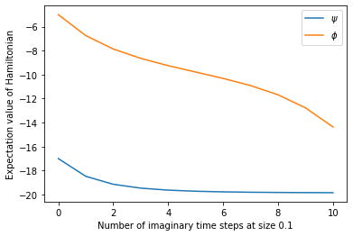
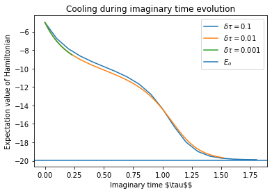
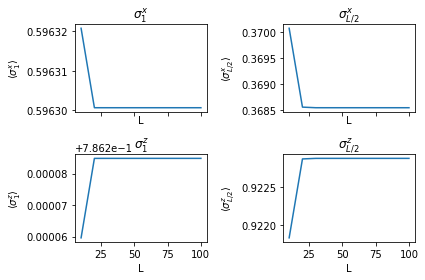
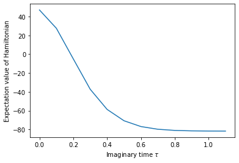

# Imaginary time evolution

$
\require{physics}
\def\bm{\boldsymbol}
$


```python
from copy import deepcopy

import numpy as np
import pandas as pd
from scipy.linalg import expm
from scipy.sparse.linalg import eigsh
import matplotlib.pyplot as plt
%matplotlib inline

from ph121c_lxvm import tensor, basis, models
```

## What we are doing

In this assignment there will be simulations of the dynamics of quantum systems
with local Hamiltonians in the matrix product state (MPS) representation.
This will be via the Time Evolving Block Decimation (TEBD) algorithm.

If you're like me and you're learning this for the first time, I looked for help
on the topic and have created this brief collection of learning materials:

- [Roger Penrose tensor diagram notation (1971)](https://www.mscs.dal.ca/%7Eselinger/papers/graphical-bib/public/Penrose-applications-of-negative-dimensional-tensors.pdfhttps://www.mscs.dal.ca/%7Eselinger/papers/graphical-bib/public/Penrose-applications-of-negative-dimensional-tensors.pdf)
- [Vidal's exposition of TEBD (2004)](https://arxiv.org/abs/quant-ph/0310089)
- [Tensor Network TEBD](https://tensornetwork.org/mps/algorithms/timeevo/tebd.html)
- [TeNPy (see `literature` for more)](https://tenpy.github.io/index.html)
- [Help with tensor networks](https://www.tensors.net/)
- [White's exposition of DMRG (1992)](https://doi.org/10.1103/PhysRevLett.69.2863)

## Overview

In TEBD, we are interested in applying a propagator $U(t)$ to evolve a quantum
state. In this section, we will use imaginary time evolution of the Hamiltonian:
$$ U(\tau) = e^{H \tau}, $$
but next section we will consider real time evolution:
$$ U(t) = e^{-i H t}. $$
We will use the following TFIM Hamiltonian with open boundary conditions
parametrized by $h^x, h^z$:
$$
    H = 
        -\sum_{i=1}^{L-1} \sigma_i^z \sigma_{i+1}^z
        -h^x \sum_{i=1}^L \sigma_i^x 
        -h^z \sum_{i=1}^L \sigma_i^z 
    .
$$
Because the Hamiltonian is 2-local, we can group its terms:
\begin{align}
    H &=
        -\left( \sum_{i=1}^L h^x \sigma_i^x + h^z \sigma_i^z \right)
        - \left( \sum_{i=1}^{L // 2} \sigma_{2i - 1}^z \sigma_{2i}^z \right)
        - \left( \sum_{i=1}^{L // 2-1+L\\%2} \sigma_{2i}^z \sigma_{2i+1}^z \right)
    \\\\
    &= H_1 + H_2^\text{even} + H_2^\text{odd}
    .
\end{align}
Now all of the terms in each group commute, but the groups themselves may not.
The Zassenhaus formula [(proven here)](https://doi.org/10.1002/cpa.3160070404)
allows a separation of $U(t)$ into a product of matrix exponentials of these
local terms, grouped in powers of $t$.
The formula tells us that the lowest order of $t$ in the exponent is given by:
$$
    U(\tau) =
    e^{H_1 \tau} e^{H_2^\text{even} \tau} e^{H_2^\text{odd} \tau}
    e^{\mathcal O (\tau^2)}
    .
$$
Note: the Zassenhaus formula looks like the Baker-Campbell-Hausdorff formula,
but they group terms differently. The former groups terms in powers of $t$, and
thus lends itself to perturbative approximations.

A corollary of the Zassenhaus formula is the Lie product formula:
$$
    e^{A + B} = \lim_{N \to \infty} \left( e^{A/N} e^{B/N} \right)^N
    .
$$
In fact, this result was known as early as 1893 by Sophus Lie, the namesake of
Lie algebras! Their work is published in ISBN 0828402329 and on the
[web](https://archive.org/details/theoriedertrans00liegoog?ref=ol&view=theater).
Thus for some finite $N$, we will are in a good position to make the 
[Suzuki](https://aip.scitation.org/doi/abs/10.1063/1.529425)-[Trotter
](https://doi.org/10.1090/S0002-9939-1959-0108732-6) decomposition
which provides an approximation of the time-evolution operator over a discrete
number of time steps:
$$
    U(\tau) \approx
        \left(
        e^{H_1 \tau/N} e^{H_2^\text{even} \tau/N} e^{H_2^\text{odd} \tau/N}
        \right)^N
    .
$$
This provides yet another example of how mathematicians have explored areas
relevant to physics more than a century before their emergence.

In practice, **this is how we will simulate time evolution of quantum systems**
on both classical computers (using the MPS representation) _and_ on quantum
computers by applying the gates on qudits in the same fashion as on the tensor
network. For higher-order Suzuki-Trotter decompositions,
[read this (cited by Vitali)](https://arxiv.org/abs/quant-ph/9809009).

## Matrix calculus

I haven't given you enough details yet to apply this to a tensor network!
I haven't exponentiated matrices that can be written as Kronecker products.

In general, matrix exponentials can be calculated in terms of diagonalizing a
matrix and exponentiating its eigenvalues, or by a power-series representation.
For a review of matrix exponentials, see these [course notes written by my summer
research mentor](https://web.mit.edu/18.06/www/Spring17/Matrix-Exponentials.pdf),
or this [paper on many ways of calculating the matrix exponential
](http://www.cs.cornell.edu/cvResearchPDF/19ways+.pdf).

My questions about Kronecker products and matrix exponentials center around
whether the operations commute: for 1-site operators, 2-site operators?
Let's begin


```python
sx = np.array([[0, 1], [1, 0]])
sy = np.array([[0, -1j], [1j, 0]])
sz = np.diag([1, -1])
```

### Two sites
For the diagonal matrix $\sigma^z$ we shall see that the matrix exponential and
Kronecker product do not commute for a 2-site operator:


```python
expm(np.kron(sz, sz))
```


    array([[2.71828183, 0.        , 0.        , 0.        ],
           [0.        , 0.36787944, 0.        , 0.        ],
           [0.        , 0.        , 0.36787944, 0.        ],
           [0.        , 0.        , 0.        , 2.71828183]])


```python
np.kron(expm(sz), expm(sz))
```


    array([[7.3890561 , 0.        , 0.        , 0.        ],
           [0.        , 1.        , 0.        , 0.        ],
           [0.        , 0.        , 1.        , 0.        ],
           [0.        , 0.        , 0.        , 0.13533528]])


Not the same! This means we actually have to exponentiate the matrix, which for
a diagonal matrix is equivalent to exponentiating the diagonal:


```python
np.exp(np.diag(np.kron(sz, sz)))
```


    array([2.71828183, 0.36787944, 0.36787944, 2.71828183])


The consequence for MPS is that this is not possible to represent as a one-site
operator, so we will have to contract a virtual index before applying this
transformation directly. (After, we will again do an SVD to return to MPS form).

We _could_ represent the matrix product operator as acting on individual sites
if we take an SVD of it and disaggregating the physical indicies by introducing
a virtual index. This option might not be viable for diagonal matrices with
large coefficients (maybe better for random unitaries):


```python
np.linalg.svd(expm(np.kron(sz, sz)))
```


    (array([[1., 0., 0., 0.],
            [0., 0., 1., 0.],
            [0., 0., 0., 1.],
            [0., 1., 0., 0.]]),
     array([2.71828183, 2.71828183, 0.36787944, 0.36787944]),
     array([[1., 0., 0., 0.],
            [0., 0., 0., 1.],
            [0., 1., 0., 0.],
            [0., 0., 1., 0.]]))


That is, if we can write the elements of a 2-site operator $U(t)$ as
$U_{\sigma'_i \sigma'_{i+1}}^{\sigma_i \sigma_{i+1}}$, then we should reshape
the matrix so that $U_{\sigma'_i \sigma_i}^{\sigma'_{i+1} \sigma_{i+1}}$
groups the physical indices by the site. Then we should do an SVD on this matrix
which will introduce a virtual index $\alpha$, leading to:
$$
    U_{\sigma'_i \sigma_i}^{\sigma'_{i+1} \sigma_{i+1}}
        = \sum_\alpha U_{\sigma'_i \sigma_i}^\alpha
        S_\alpha^\alpha (V^\dagger)_{\alpha}^{\sigma'_{i+1} \sigma_{i+1}}
    .
$$
We should then reshape
$U_{\sigma'_i \sigma_i}^\alpha \to U_{\sigma'_i}^{\sigma_i \alpha}$ and
$(V^\dagger)_{\alpha}^{\sigma'_{i+1} \sigma_{i+1}}
\to (V^\dagger)_{\alpha \sigma'_{i+1}}^{\sigma_{i+1}}$
so that we can apply these operators to the physical indices as a matrix
multiplication. This opens the door to matrix product operators, which have very
similar properties as MPS, except for the additional physical index.

### One site

#### Diagonal matrix

We shall see that for a 1-site operator, the matrix exponential commutes with
a Kronecker product by the identity:


```python
expm(np.kron(np.eye(2), sz))
```


    array([[2.71828183, 0.        , 0.        , 0.        ],
           [0.        , 0.36787944, 0.        , 0.        ],
           [0.        , 0.        , 2.71828183, 0.        ],
           [0.        , 0.        , 0.        , 0.36787944]])


```python
np.kron(np.eye(2), expm(sz))
```


    array([[2.71828183, 0.        , 0.        , 0.        ],
           [0.        , 0.36787944, 0.        , 0.        ],
           [0.        , 0.        , 2.71828183, 0.        ],
           [0.        , 0.        , 0.        , 0.36787944]])


#### Non-diagonal matrix

For the off-diagonal matrix $\sigma^x$, the operations still commute across
Kronecker products with the identity:


```python
expm(np.kron(np.eye(2), sx))
```


    array([[1.54308063, 1.17520119, 0.        , 0.        ],
           [1.17520119, 1.54308063, 0.        , 0.        ],
           [0.        , 0.        , 1.54308063, 1.17520119],
           [0.        , 0.        , 1.17520119, 1.54308063]])


```python
np.kron(np.eye(2), expm(sx))
```


    array([[1.54308063, 1.17520119, 0.        , 0.        ],
           [1.17520119, 1.54308063, 0.        , 0.        ],
           [0.        , 0.        , 1.54308063, 1.17520119],
           [0.        , 0.        , 1.17520119, 1.54308063]])


All in all, this means we can time-evolve local operators efficiently by
calculating their matrix exponentials locally.

Since in fact $\sigma^x$ is related to $\sigma^z$ by a Hadamard rotation. $T$,
we can compute:
$$
    \exp(\phi \sigma^x)
        = \exp(\phi T \sigma^z T)
        = T \exp(\phi \sigma^z) T
    .
$$
Let's demonstrate:


```python
hd = np.array([[1, 1], [1, -1]]) * np.sqrt(0.5)
```


```python
expm(sx)
```


    array([[1.54308063, 1.17520119],
           [1.17520119, 1.54308063]])


```python
expm(hd @ sz @ hd)
```


    array([[1.54308063, 1.17520119],
           [1.17520119, 1.54308063]])


```python
hd @ expm(sz) @ hd
```


    array([[1.54308063, 1.17520119],
           [1.17520119, 1.54308063]])


We might prefer to use the result in the assignment that for a 1-site operator:
$$
    \exp(i t \bm n \cdot \bm \sigma)
        = \cos(t) + i \sin(t) \bm n \cdot \bm \sigma
    .
$$
For imaginary time evolution:
$$
    \exp(\tau \bm n \cdot \bm \sigma)
        = \cos(-i \tau) + i \sin(-i \tau) \bm n \cdot \bm \sigma
        = \cosh(\tau) + \sinh(\tau) \bm n \cdot \bm \sigma
    .
$$


```python
# Verify formula expontentiation formulas
hx, hz = 1.05, 0.5
hn = np.sqrt(hx ** 2 + hz ** 2)
np.allclose(
    expm((hx * sx + hz * sz) / hn),
    np.cosh(1) * np.eye(2) + np.sinh(1) * ((hx * sx + hz * sz) / hn)
)
```


    True


## Action

At this stage, I have layed out the Suzuki-Trotter decomposition as well as how
to represent the gates within each term, so we can go ahead and do TEBD.
We are told to evolve a ferromagnetic state:
\begin{align}
    \ket{\psi (t=0)}
        &= \ket{\downarrow} \otimes \cdots \otimes \ket{\downarrow}
    ,
    \\\\
    \ket{\phi (t=0)}
        &= \ket{\uparrow} \otimes \cdots \otimes \ket{\uparrow}
    .
\end{align}


```python
L  = 12
d  = 2
hx = 1.05
hz = 0.5
```


```python
down = np.array([1., 0.]).reshape(2, 1)
up   = down[::-1].reshape((2, 1))

# build wavefunction in MPS representation
ψ = tensor.mps(L=L, d=d)
ψ.from_arr([ down for _ in range(L) ], center=-1)
ϕ = tensor.mps(L=L, d=d)
ϕ.from_arr([ up for _ in range(L) ], center=-1)
```

We are asked to calculate the energy of this state which requires a Hamiltonian.


```python
sx = np.diag([1., 1.])[::-1]
sz = np.diag([1.,-1.])

# Build pieces of Hamiltonian in gate representation
def build_pieces_of_H (L, d, hx, hz):
    """Build the field, odd, and even term Hamiltonians and also their union."""
    H_field = np.empty(L, dtype='O')
    for i in range(H_field.size):
        H_field[i] = tensor.mpo(L=L, d=d)
        H_field[i].set_local_oper(-(hx * sx + hz * sz), i + 1)
    H_odd = np.empty(L//2, dtype='O')
    for i in range(H_odd.size):
        H_odd[i] = tensor.mpo(L=L, d=d)
        H_odd[i].set_local_oper(-sz, 2*i + 1)
        H_odd[i].set_local_oper(sz, 2*i + 1 + 1)
    H_even = np.empty(L//2 - 1 + L%2, dtype='O')
    for i in range(H_even.size):
        H_even[i] = tensor.mpo(L=L, d=d)
        H_even[i].set_local_oper(-sz, 2*(i + 1))
        H_even[i].set_local_oper(sz, 2*(i + 1) + 1)
    H_full = np.array([*H_field, *H_odd, *H_even], dtype='O')
    return (H_field, H_odd, H_even, H_full)
```


```python
H_field, H_odd, H_even, H_full = build_pieces_of_H(L=L, d=d, hx=hx, hz=hz)
```


```python
for name, wave in [('psi', ψ), ('phi', ϕ)]:
    print('MPS Energy of', name, sum(e.expval(wave) for e in H_full))
```

    MPS Energy of psi -17.0
    MPS Energy of phi -5.0


As a verification, let's compare this to the direct calculation from the Hamiltonian.


```python
ψ.merge_bonds()
ψ.reset_pos()
psic = ψ[0].mat.reshape(ψ.size())
np.inner(psic, models.tfim_z.H_vec(psic, L, hx, 'o', hz))
```


    -17.0


```python
ϕ.merge_bonds()
ϕ.reset_pos()
phic = ϕ[0].mat.reshape(ϕ.size())
np.inner(phic, models.tfim_z.H_vec(phic, L, hx, 'o', hz))
```


    -5.0


```python
# Restore MPS compression to these product states
ψ.split_quanta(-1, trim = 1)
ϕ.split_quanta(-1, trim = 1)
```

### Implementation

Somehow, my code was influenced by the interface to the Julia
[ITensor](https://itensor.org/) package. I haven't used the package, but
seeing that in their code they define everything in terms of indices
and operations on them convinced me I should write classes which do the
same. Keeping track of indices is a pain, so reducing everything to index
operations on my MPS representation (which is basically a list of matrices,
where each matrix has a multiindex for both rows and columns) hopefully
makes algorithms less difficult to program when the essential methods work.

In order to do this, I made many backwards-incompatible changes to my
previous MPS code, which was rather simple to begin with.
Now, there is a TON of stuff going on under the hood to provide a composable
set of elementary tensor operations that are abstracted away from the storage
and representation details of the tensors themselves.
The basic problems are: how do you keep track of a set of indices as a data
structure, and how to you selectively operate on these indices with operations
such as contractions, reshapes, and reorderings.
A lot of this comes down to giving bonds pointers to sites.
When these tasks can, to some extent, be automated, then they open the door
to splitting multi-indices with SVD's, to MPS canonical forms, and to tensor
network contractions.
The icing on the cake, so to speak, is taking these operations and composing
them into algorithms for quantum simulation, such as TEBD, which we are about to
undertake, as well as DMRG (maybe next time?).
The difficulty of these algorithms is in applying gates repeatedly to different
groups of indices, creating a lot of book-keeping.
There are _a lot_ of books to keep.

To be clear, there is no attempt to optimize code, mainly just a framework for
matrix operations where the row and column indices are replaced by multiindices.
It maybe succeeds in reducing code repetition when actually expressing algorithms.
For the programmer, the price of abstraction is payed by usability.
I want to be able to apply an operator on a specific set of indices without
having to manually manipulate the matrices each time I do an experiment.

I also started to 1-index the sites in the tensor trains, which is bound to
create confusion!


### Greatest achievement of this course

The following function is the greatest function I've written:


```python
def multi_index_perm (dims, perm):
    """Return a slice to permute a multi-index in the computational basis.
    
    `dims` and `perm` enumerate 0 to N-1 as the fastest-changing dit to slowest.
    E.g. perm = np.arange(N) is the identity permutation.

    Arguments:
    dims :: np.ndarray(N) :: dimensions of each index
    perm :: np.ndarray(N) :: perm[i] gives the new position of i
    """
    assert dims.size == perm.size
    iperm = np.argsort(perm)
    new_dims = dims[iperm]
    index = np.zeros(np.prod(dims), dtype='int64')
    for i in range(len(dims)):
        index += np.tile(
            np.repeat(
                np.prod(dims[:iperm[i]], dtype='int64')
                * np.arange(dims[iperm[i]]),
                repeats=np.prod(new_dims[:i], dtype='int64')
            ),
            reps=np.prod(new_dims[i+1:], dtype='int64')
        )
    return index
```

It performs any arbitrary permutation of a multi-index (with any dimensions).
It's great to have this function because it gives unlimited flexibility in the
manipulation of indices within a multi-index in order to sort indices after 
sophisticated tensor manipulations.
Whoever uses this function has to be highly aware of the issue of endianness,
which I believe asserts itself in both the order of the array `dims` as well as
the order of `np.tile` and `np.repeat`.
This function generalizes `ph121c_lxvm.basis.schmidt.permute`, which can only
be applied to multi-indices where each index has dimension 2, which was useful
earlier for qubit chains, but cannot be generalized because its algorithm is
based on bit swaps, and bit indices always have dimension 2.
The function is great because it works: it is the endgame of indices.

I have no idea if `np.ravel_multi_index` does the same thing: I suspect it 
doesn't. In principle, this function should overcome the limitations imposed
by the maximal `ndim` set by `numpy`, though of course too many dimensions will
lead to dangerously large arrays.

Here is an example of how to create and invert a permutation with both methods:


```python
tensor.multi_index_perm(
    np.array([2,2,2,2,2,2]),
    np.array([5,2,0,3,1,4])
)[tensor.multi_index_perm(
    np.array([2,2,2,2,2,2]),
    np.array([2,4,1,3,5,0])
)]
```


    array([ 0,  1,  2,  3,  4,  5,  6,  7,  8,  9, 10, 11, 12, 13, 14, 15, 16,
           17, 18, 19, 20, 21, 22, 23, 24, 25, 26, 27, 28, 29, 30, 31, 32, 33,
           34, 35, 36, 37, 38, 39, 40, 41, 42, 43, 44, 45, 46, 47, 48, 49, 50,
           51, 52, 53, 54, 55, 56, 57, 58, 59, 60, 61, 62, 63])


```python
basis.schmidt.permute(
    basis.schmidt.permute(
        np.arange(64), [], 6, perm=np.array([5,2,0,3,1,4])
    ), [], 6, perm=np.array([2,4,1,3,5,0])
)
```


    array([ 0,  1,  2,  3,  4,  5,  6,  7,  8,  9, 10, 11, 12, 13, 14, 15, 16,
           17, 18, 19, 20, 21, 22, 23, 24, 25, 26, 27, 28, 29, 30, 31, 32, 33,
           34, 35, 36, 37, 38, 39, 40, 41, 42, 43, 44, 45, 46, 47, 48, 49, 50,
           51, 52, 53, 54, 55, 56, 57, 58, 59, 60, 61, 62, 63])


### Everything else

If you read the source code in `ph121c_lxvm.tensor`, you might think that it is
disgusting, and I would agree with you. The code mainly enforces the topology of
a tensor network and automates operations on the network. Should it be 10 lines
of code? Probably. It's over 1500.

Also, Python does not have a compiler that enforces types, so it is up to the
programmer to enforce type stability. 
For me, that meant writing code in a LBYL (look before you leap) style, whereas
some Python code is better in the EAFP (it’s easier to ask for forgiveness than 
permission) style.

The structure of the `tensor` module is the following: an `index` class is defined
by subclassing `collections.UserList` and adding two attributes and some methods.
Then `multi_index`, `bond`, and `quanta` are subclasses of `index` and they 
enforce some restrictions of the types of elements and attributes in the index.
Separately, the `site` type is a collection of a `np.ndarray` with `ndim=2` and 
a `multi_index` of two `multi_index`es representing the row and column indices. 
The `site` implements SVD, contraction, and sorting operations on the matrix indices. 
Then the `train` type is a `UserList` of `site`s with methods to manipulate these.
Lastly, `mps` and `mpo` are subclasses of `train` with particular methods.

I'll also mention that preserving the topology of the network (i.e. pointers between sites)
during operations which involve not in-place operations such as contractions
requires a bit of wizardry to keep the references altogether.
The process behaves a fair bit like DNA replication.


I only implemented some things this way because the `deepcopy` function in the `copy` module apparently knows how to do this correctly.

By the way, the module I wrote is neither complete nor robust.
You cannot yet compose things as I had hoped for, but hopefully
time evolution should work reliably

### Direct approach

We will apply the gates in the Hamiltonian directly, which necessitates
regrouping the physical indices into sites which match the gates.

We will first exponentiate each group in the Hamiltonian


```python
# Construct propagators
def build_propagators (L, d, δτ, H_field, H_odd, H_even):
    """Exponentiate each non-commuting piece of the Hamiltonian"""
    U_field = tensor.mpo(L=L, d=d)
    for i, e in enumerate(H_field):
        U_field.set_local_oper(expm(-δτ * e[0].mat), i+1)
    U_odd = tensor.mpo(L=L, d=d)
    for i, e in enumerate(H_odd):
        U_odd.set_local_oper(
            expm(-δτ * np.kron(e[1].mat, e[0].mat)),
            2 * i + 1
        )
    U_even = tensor.mpo(L=L, d=d)
    for i, e in enumerate(H_even):
        U_even.set_local_oper(
            expm(-δτ * np.kron(e[1].mat, e[0].mat)),
            2 * (i + 1)
        )
    return (U_field, U_odd, U_even)
```

Let's evolve imaginary time


```python
L  = 12
d  = 2
hx = 1.05
hz = 0.5
δτ = 0.1
```


```python
%%time
# States
wave = deepcopy(ψ)
cave = deepcopy(ϕ)
# Max rank
chi = 16
# Operators
H_field, H_odd, H_even, H_full = build_pieces_of_H(L=L, d=d, hx=hx, hz=hz)
U_field, U_odd, U_even = build_propagators(
    L=L, d=d, δτ=δτ, H_field=H_field, H_odd=H_odd, H_even=H_even
)
# Results
ψ_energies = [sum(e.expval(wave) for e in H_full)]
ϕ_energies = [sum(e.expval(cave) for e in H_full)]
# TEBD pattern
Nstp = 10
for _ in range(Nstp):
    for e in [U_field, U_even, U_odd]:
        e.oper(wave, inplace=True)
    wave.trim_bonds(chi)
    wave.normalize()
    ψ_energies.append(sum(e.expval(wave) for e in H_full))
for _ in range(Nstp):
    for e in [U_field, U_even, U_odd]:
        e.oper(cave, inplace=True)
    cave.trim_bonds(chi)
    cave.normalize()
    ϕ_energies.append(sum(e.expval(cave) for e in H_full))
```

    CPU times: user 2min 23s, sys: 1.75 s, total: 2min 25s
    Wall time: 27 s


```python
# Hamiltonian system: energy should be conserved
plt.plot(ψ_energies, label='$\psi$')
plt.plot(ϕ_energies, label='$\phi$')
plt.xlabel(f'Number of imaginary time steps at size {δτ}')
plt.ylabel('Expectation value of Hamiltonian')
plt.legend()
plt.show()
```


    

    


Simulation worked!
The states are loosing energy and converging to the ground state.
We'll come back to this after the next section to do some physics.

### MPO approach

Here I outline the approach I described that was relayed to me by Gil.
There is also an excellent explanation of this on the Tensor Network website.

Start by taking the set of operators, splitting them, stacking them.
Then do TEBD my applying the stacked operator.
Potentially the bond dimension is larger than in the other case,
but analytically it should be the same.


```python
U_field.split_quanta(-1)
U_odd.split_quanta(-1)
U_even.split_quanta(-1)
U_full = U_field.oper(U_odd.oper(U_even))
```


    ---------------------------------------------------------------------------

    ValueError                                Traceback (most recent call last)

    <ipython-input-31-a23f6b796b43> in <module>
          2 U_odd.split_quanta(-1)
          3 U_even.split_quanta(-1)
    ----> 4 U_full = U_field.oper(U_odd.oper(U_even))
    

    ~/Documents/repos/ph121c/ph121c_lxvm/ph121c_lxvm/tensor/mpo.py in oper(self, tren, inplace)
        166         for i in range(len(self)):
        167             tags = [ e.tag for e in self[i].get_type(quantum) if (e.tag > 0) ]
    --> 168             output.groupby_quanta_tag(tags)
        169             center_pos = output.index(output.center)
        170             # Here is where we apply the operator to the new center


    ~/Documents/repos/ph121c/ph121c_lxvm/ph121c_lxvm/tensor/mpo.py in groupby_quanta_tag(self, tag_group)
        140             if chunk:
        141                 self.set_local_oper(np.eye(self.d ** len(chunk)), min(chunk))
    --> 142         return super().groupby_quanta_tag(tag_group)
        143 
        144     ## These methods must not modify the mps or mpo instance (except reshape)!


    ~/Documents/repos/ph121c/ph121c_lxvm/ph121c_lxvm/tensor/train.py in groupby_quanta_tag(self, tag_group)
        263         new_center = list(self.get_sites(tag_group))
        264         assert (len(new_center) == 1), 'unable to distinguish site.'
    --> 265         self.canonize(new_center[0])
        266 
        267     def contract_quanta (self, raised, lowered):


    ~/Documents/repos/ph121c/ph121c_lxvm/ph121c_lxvm/tensor/train.py in canonize(self, center)
        160                         bnd = next(self[i].ind[1].get_type(bond))
        161                         self.split_site(self[i], center_tag)
    --> 162                         self.contract_bond(bnd)
        163                     except StopIteration:
        164                         pass


    ~/Documents/repos/ph121c/ph121c_lxvm/ph121c_lxvm/tensor/train.py in contract_bond(self, bnd)
         83         assert isinstance(bnd, bond), \
         84             f'received type {type(bnd)} but need index.bond'
    ---> 85         left_pos, right_pos = sorted( self.index(e) for e in bnd.tag )
         86         assert ((right_pos - left_pos) == 1), \
         87             'bond should connect adjacent sites.'


    ~/Documents/repos/ph121c/ph121c_lxvm/ph121c_lxvm/tensor/train.py in <genexpr>(.0)
         83         assert isinstance(bnd, bond), \
         84             f'received type {type(bnd)} but need index.bond'
    ---> 85         left_pos, right_pos = sorted( self.index(e) for e in bnd.tag )
         86         assert ((right_pos - left_pos) == 1), \
         87             'bond should connect adjacent sites.'


    ~/.conda/envs/ph121c/lib/python3.7/collections/__init__.py in index(self, item, *args)
       1138     def copy(self): return self.__class__(self)
       1139     def count(self, item): return self.data.count(item)
    -> 1140     def index(self, item, *args): return self.data.index(item, *args)
       1141     def reverse(self): self.data.reverse()
       1142     def sort(self, *args, **kwds): self.data.sort(*args, **kwds)


    ValueError: site( # at 0x7f5a3b00a3d0
      array([[1.10517092, 0.        , 0.        , 0.        ],
             [0.        , 0.90483742, 0.        , 0.        ],
             [0.        , 0.        , 0.90483742, 0.        ],
             [0.        , 0.        , 0.        , 1.10517092]]),
      multi_index(dim=16, tag=2, shape=(4, 4)) # at 0x7f5a380cbe90
    ) is not in list


Well, debugging is hard, and that looks like a bond reference failed to update.
This means my `mpo.oper` method that I use on `mps` types doesn't generalize
to `mpo` types. I thought I should write a generic function on `train` types, but 
it doesn't seem necessary.

## Convergence to ground state

We will study the convergence to the ground state of the MPS wavefunction of $\ket{\psi}$ for system sizes $L=12, 32, 64, 128$.
For larger systems, we will make some measurements on these wavefunctions.
Recall
\begin{align}
    \ket{\psi (t=0)}
        &= \ket{\uparrow} \otimes \cdots \otimes \ket{\uparrow}
    .
\end{align}

### Comparing to ED

Let's setup a quick calculation for the ground state energy at the small
system using a sparse eigensolver and our exact methods from earlier in the course.


```python
L  = 12
d  = 2
hx = 1.05
hz = 0.5
```


```python
%time Eₒ = eigsh(models.tfim_z.H_oper(L, hx, 'o', hz), k=1, return_eigenvectors=False)[0]
```

    CPU times: user 160 ms, sys: 0 ns, total: 160 ms
    Wall time: 28.4 ms


```python
Eₒ
```


    -19.94577803903926


Well, that was quick (thank you Fortran) and seems really close to the
minimum reached by our earlier time evolution.
We'll do the same run this time except by truncating the simulation
when the relative energy difference $|(E_n - E_{n-1}) / E_n|$ converges to
to under $0.001$.
We will also compare time step sizes of $\delta\tau = 0.1, 0.01, 0.001$


```python
%%time
# State
ψ = tensor.mps(L=L, d=d)
ψ.from_arr([ up for _ in range(L) ], center=-1)
# Operators
H_field, H_odd, H_even, H_full = build_pieces_of_H(L=L, d=d, hx=hx, hz=hz)
# Results
ψ_converged = []
ψ_data = dict(dtau=[], tau=[], E=[], relerr=[])
E_initial = sum(e.expval(ψ) for e in H_full)
# TEBD pattern
rtol = 0.001
step_sizes = [0.1, 0.01, 0.001]
for δτ in step_sizes:
    U_field, U_odd, U_even = build_propagators(
        L=L, d=d, δτ=δτ, H_field=H_field, H_odd=H_odd, H_even=H_even
    )
    i = 0
    relerr = 1
    wave = deepcopy(ψ)
    # Max rank
    chi = 16
    ψ_data['E'].append(E_initial)
    ψ_data['relerr'].append(relerr)
    ψ_data['tau'].append(0)
    ψ_data['dtau'].append(δτ)
    while (relerr > rtol):
        for e in [U_field, U_even, U_odd]:
            e.oper(wave, inplace=True)
        wave.trim_bonds(chi)
        wave.normalize()
        i += 1
        ψ_data['E'].append(sum(e.expval(wave) for e in H_full))
        relerr = abs((ψ_data['E'][-1] - ψ_data['E'][-2]) / ψ_data['E'][-1])
        ψ_data['relerr'].append(relerr)
        ψ_data['dtau'].append(δτ)
        ψ_data['tau'].append(δτ * i)
        if ((i % 10) == 0):
            print(f'Completed step {i} :: dtau={δτ} :: relative error {relerr}')
    ψ_converged.append(wave)
    print(f'dtau={δτ} converged within rtol={rtol} in {i} steps')
```

    Completed step 10 :: dtau=0.1 :: relative error 0.11052898331065479
    dtau=0.1 converged within rtol=0.001 in 18 steps
    Completed step 10 :: dtau=0.01 :: relative error 0.022332604616300347
    Completed step 20 :: dtau=0.01 :: relative error 0.011880294254134427
    Completed step 30 :: dtau=0.01 :: relative error 0.007629698816700093
    Completed step 40 :: dtau=0.01 :: relative error 0.005785861024167228
    Completed step 50 :: dtau=0.01 :: relative error 0.005081225438163214
    Completed step 60 :: dtau=0.01 :: relative error 0.00508097227745834
    Completed step 70 :: dtau=0.01 :: relative error 0.00569205153874006
    Completed step 80 :: dtau=0.01 :: relative error 0.0069837469402630695
    Completed step 90 :: dtau=0.01 :: relative error 0.008954310702568432
    Completed step 100 :: dtau=0.01 :: relative error 0.010836955888001671
    Completed step 110 :: dtau=0.01 :: relative error 0.01064547975484463
    Completed step 120 :: dtau=0.01 :: relative error 0.00777394581004741
    Completed step 130 :: dtau=0.01 :: relative error 0.004476012311521265
    Completed step 140 :: dtau=0.01 :: relative error 0.0022887756487684255
    Completed step 150 :: dtau=0.01 :: relative error 0.0011280931348894825
    dtau=0.01 converged within rtol=0.001 in 152 steps
    Completed step 10 :: dtau=0.001 :: relative error 0.004774673781280013
    Completed step 20 :: dtau=0.001 :: relative error 0.004323138641314433
    Completed step 30 :: dtau=0.001 :: relative error 0.00392955707201135
    Completed step 40 :: dtau=0.001 :: relative error 0.0035844021354098947
    Completed step 50 :: dtau=0.001 :: relative error 0.0032801300378205926
    Completed step 60 :: dtau=0.001 :: relative error 0.003010679087888506
    Completed step 70 :: dtau=0.001 :: relative error 0.0027711150845904963
    Completed step 80 :: dtau=0.001 :: relative error 0.0025573753974013425
    Completed step 90 :: dtau=0.001 :: relative error 0.0023660809762896203
    Completed step 100 :: dtau=0.001 :: relative error 0.0021943960112396467
    Completed step 110 :: dtau=0.001 :: relative error 0.0020399215959311257
    Completed step 120 :: dtau=0.001 :: relative error 0.001900614044379694
    Completed step 130 :: dtau=0.001 :: relative error 0.0017747213431069935
    Completed step 140 :: dtau=0.001 :: relative error 0.001660733126377698
    Completed step 150 :: dtau=0.001 :: relative error 0.0015573408639144618
    Completed step 160 :: dtau=0.001 :: relative error 0.001463405852678402
    Completed step 170 :: dtau=0.001 :: relative error 0.0013779332397855937
    Completed step 180 :: dtau=0.001 :: relative error 0.0013000507557396686
    Completed step 190 :: dtau=0.001 :: relative error 0.0012289911630306628
    Completed step 200 :: dtau=0.001 :: relative error 0.0011640776634128044
    Completed step 210 :: dtau=0.001 :: relative error 0.0011047116817713394
    Completed step 220 :: dtau=0.001 :: relative error 0.0010503625757645177
    Completed step 230 :: dtau=0.001 :: relative error 0.001000558917304315
    dtau=0.001 converged within rtol=0.001 in 231 steps
    CPU times: user 53min 4s, sys: 36.8 s, total: 53min 41s
    Wall time: 9min


```python
df = pd.DataFrame(ψ_data)
```


```python
fig, ax = plt.subplots()

for i, δτ in enumerate(step_sizes):
    ax.plot(
        df.tau[df.dtau == δτ].values,
        df.E[df.dtau == δτ].values,
        label = f'$\\delta \\tau={δτ}$'
    )
ax.axhline(Eₒ, label='$E_o$')
ax.set_title('Cooling during imaginary time evolution')
ax.set_xlabel(f'Imaginary time $\\tau$$')
ax.set_ylabel('Expectation value of Hamiltonian')
ax.legend()
plt.show()
```


    

    


Clearly the smallest step size reached the desired relative tolerance much
earlier than the others because the relative tolerance was kept the same
across the different time step sizes.
I really don't want to wait an hour to evolve all that time anyway, so I'm
glad that it stopped itself.
Anyway, we can take a look at the final converged energies to get a more
precise view of this


```python
print('ED ground state energy ::', Eₒ)
for δτ in step_sizes:
    print(
        f'converged ground state energy, δτ={δτ} ::',
        df.E[df.dtau == δτ].values[-1]
    )
```

    ED ground state energy :: -19.94577803903926
    converged ground state energy, δτ=0.1 :: -19.877286728955642
    converged ground state energy, δτ=0.01 :: -19.679317693465716
    converged ground state energy, δτ=0.001 :: -8.535746649468903


So actually the larger step size gave us a better estimate of the energy, 
just because it did not converge too early!
Another question is how close the MPS ground state is to the ED ground state:


```python
_, gs = eigsh(models.tfim_z.H_oper(L, hx, 'o', hz), k=1)
```


```python
ψ = deepcopy(ψ_converged[0])
ψ.merge_bonds()
ψ.reset_pos()
```


```python
np.inner(ψ[0].mat.reshape(gs.size), gs.reshape(gs.size))
```


    -0.9942849322190765


The overlap of the two states is surprisingly good!
The negative sign due to phase is not meaningful.

### Larger system sizes

Let's boost to a larger systems and compute their approximate ground states.
We can measure correlation functions in these ground states and
compare their energies.
We will not be measuring their energies every step but instead I will
just simulate 20 time steps of each with $\delta\tau = 0.1$ because it
is expensive to calculate a Hamiltonian of 200 terms.
I'll just be testing the systems of size $L = 10n$ for $n= 1, \dots, 10$.


```python
%%time
L_list = list(range(10, 110, 10))
ψ_converged = []
ψ_energies = []
δτ = 0.1
for L in L_list:
    ψ = tensor.mps(L=L, d=d)
    ψ.from_arr([ up for _ in range(L) ], center=-1)
    H_field, H_odd, H_even, H_full = build_pieces_of_H(
        L=L, d=d, hx=hx, hz=hz
    )
    U_field, U_odd, U_even = build_propagators(
        L=L, d=d, δτ=δτ, H_field=H_field, H_odd=H_odd, H_even=H_even
    )
    # Max rank
    chi = 16
    Nstp = 20
    # TEBD
    for i in range(Nstp):
        for e in [U_field, U_even, U_odd]:
            e.oper(ψ, inplace=True)
        ψ.trim_bonds(chi)
        ψ.normalize()
    ψ_converged.append(ψ)
    ψ_energies.append(sum( e.expval(ψ) for e in H_full ))
    print(f'Completed {Nstp} steps at system size {L}')
```

    Completed 20 steps at system size 10
    Completed 20 steps at system size 20
    Completed 20 steps at system size 30
    Completed 20 steps at system size 40
    Completed 20 steps at system size 50
    Completed 20 steps at system size 60
    Completed 20 steps at system size 70
    Completed 20 steps at system size 80
    Completed 20 steps at system size 90
    Completed 20 steps at system size 100
    CPU times: user 5h 56min 54s, sys: 4min 14s, total: 6h 1min 9s
    Wall time: 1h 4min 33s


Wow, that took a really long time to simulate :(.
The really dumb thing that someone should be scolding me for is:
"why am I using the all spin-up wavefunction as an ansatz".
At the beginning of this notebook, I used the all spin-down wavefunction,
which starts out closer to the ground state so that I wouldn't have to
evolve the state for so long.

Anyway, we have the wavefunctions so let's be sure to
measure interesting things on them. First, let's display the difference
$(E(L+x) - E(L))/x$


```python
fig, ax = plt.subplots()
ax.plot(
    L_list[:-1], 
    [ ((ψ_energies[i] - ψ_energies[i + 1]) / (L_list[i+1] - L))
     for i, L in enumerate(L_list[:-1]) ],
)
ax.set_title('Convergence of estimated $E_{gs}$')
ax.set_xlabel('$L$')
ax.set_ylabel('(E(L+10) - E(L))/10')
plt.show()
```


    

    


```python
i=7; ((ψ_energies[i] - ψ_energies[i + 1]) / (L_list[i+1] - L))
```


    -1.7171464427371574


Great, it looks like this quantity reaches a stable value -1.71714 in the
$L \to \infty$ limit.
Now let's measure some of our favorite correlation functions on all
of these wavefunctions. We can't really measure our 2-point correlation
functions from the first assignment without incurring some large tensor
contractions, so we'll stick to measuring
$\ev{\sigma_{L/2}^x}, \ev{\sigma_1^x}, \ev{\sigma_{L/2}^z}, \ev{\sigma_1^z}$.


```python
def make_observables (L, d):
    """Create the observable operators of interest."""
    s1x = tensor.mpo(L=L, d=d)
    s1x.set_local_oper(sx, 1)
    sL2x = tensor.mpo(L=L, d=d)
    sL2x.set_local_oper(sx, L//2)
    s1z = tensor.mpo(L=L, d=d)
    s1z.set_local_oper(sz, 1)
    sL2z = tensor.mpo(L=L, d=d)
    sL2z.set_local_oper(sz, L//2)
    return (s1x, sL2x, s1z, sL2z)
```


```python
%%time
observables = dict(L=[], s1x=[], sL2x=[], s1z=[], sL2z=[])
for i, L in enumerate(L_list):
    s1x, sL2x, s1z, sL2z = make_observables(L, d)
    observables['s1x'].append(s1x.expval(ψ_converged[i]))
    observables['sL2x'].append(sL2x.expval(ψ_converged[i]))
    observables['s1z'].append(s1z.expval(ψ_converged[i]))
    observables['sL2z'].append(sL2z.expval(ψ_converged[i]))
    observables['L'].append(L)
```

    CPU times: user 16 s, sys: 128 ms, total: 16.1 s
    Wall time: 2.69 s


```python
df = pd.DataFrame(observables)
nrow, ncol = 2, 2
fig, axes = plt.subplots(nrow, ncol, sharex=True)
names = [('s1x', '$\\sigma_1^x$'), ('sL2x', '$\\sigma_{L/2}^x$'),
         ('s1z', '$\\sigma_1^z$'), ('sL2z', '$\\sigma_{L/2}^z$')]
for i, row in enumerate(axes):
    for j, ax in enumerate(row):
        ax.plot(L_list, df[names[ncol*i + j][0]].values)
        ax.set_title(names[ncol*i + j][1])
        ax.set_xlabel('L')
        ax.set_ylabel('$\\langle$' + names[ncol*i + j][1] + '$\\rangle$')
fig.tight_layout()
```


    

    


Interesting to see that $\sigma_i^x$ is of the same order of magnitude
at the center and boundary of the spin chain, but that for $\sigma_i^z$
the correlator nearly vanishes at the boundary but is nearly saturated
at the center.

I find it surprising that for such a large system that these results aren't ridden with numerical noise.

## a Néel-ing

Let's see the convergence to the ground state of an alternating spin chain.

\begin{align}
    \ket{\psi (t=0)}
        &= \ket{\uparrow} \otimes \ket{\downarrow} \otimes \cdots
    .
\end{align}
We'll choose a system size which is twice as large as what I did in
assignment 1 with my sparse Lanczos solver so that it is larger but
won't take forever. Voilá $L=48$.


```python
%%time
L = 48
ψ = tensor.mps(L=L, d=d)
wave = []
for i in range(L // 2):
    wave.append(up)
    wave.append(down)
assert (len(wave) == L)
ψ.from_arr(wave, center=-1)
H_field, H_odd, H_even, H_full = build_pieces_of_H(L=L, d=d, hx=hx, hz=hz)
# Results
ψ_energies = [sum(e.expval(ψ) for e in H_full)]
# TEBD pattern
rtol = 0.001
δτ = 0.1
U_field, U_odd, U_even = build_propagators(
    L=L, d=d, δτ=δτ, H_field=H_field, H_odd=H_odd, H_even=H_even
)
chi = 16
i = 0
relerr = 1
while (relerr > rtol):
    for e in [U_field, U_even, U_odd]:
        e.oper(ψ, inplace=True)
    ψ.trim_bonds(chi)
    ψ.normalize()
    ψ_energies.append(sum(e.expval(ψ) for e in H_full))
    relerr = abs((ψ_energies[-1] - ψ_energies[-2]) / ψ_energies[-1])
    i += 1
    if ((i % 10) == 0):
        print(f'Completed step {i} :: dtau={δτ} :: relative error {relerr}')
print(f'dtau={δτ} converged within rtol={rtol} in {i} steps')
```

    Completed step 10 :: dtau=0.1 :: relative error 0.0021793080500920876
    dtau=0.1 converged within rtol=0.001 in 11 steps
    CPU times: user 22min 38s, sys: 15.8 s, total: 22min 54s
    Wall time: 4min 12s


```python
plt.plot(δτ * np.arange(len(ψ_energies)), ψ_energies)
plt.xlabel('Imaginary time $\\tau$')
plt.ylabel('Expectation value of Hamiltonian')
plt.show()
```


    

    


It looks like this state cools in less than half the time the first simulation,
which had a system size of 1/4th of this one, did.
I didn't realize that larger systems could potentially converge faster,
especially noticing that this state starts with positive energy.
But it might also be the 
In this system, the converged ground state energy is:


```python
ψ_energies[-1]
```


    -81.72930885147767


Let's measure some correlators again


```python
observables = dict(L=[], s1x=[], sL2x=[], s1z=[], sL2z=[])
s1x, sL2x, s1z, sL2z = make_observables(L, d)
observables['s1x'].append(s1x.expval(ψ))
observables['sL2x'].append(sL2x.expval(ψ))
observables['s1z'].append(s1z.expval(ψ))
observables['sL2z'].append(sL2z.expval(ψ))
observables['L'].append(L)
```


    ---------------------------------------------------------------------------

    MemoryError                               Traceback (most recent call last)

    <ipython-input-170-aeb7d931d025> in <module>
          2 s1x, sL2x, s1z, sL2z = make_observables(L, d)
          3 observables['s1x'].append(s1x.expval(ψ))
    ----> 4 observables['sL2x'].append(sL2x.expval(ψ))
          5 observables['s1z'].append(s1z.expval(ψ))
          6 observables['sL2z'].append(sL2z.expval(ψ))


    ~/Documents/repos/ph121c/ph121c_lxvm/ph121c_lxvm/tensor/mpo.py in expval(self, tren)
        201             else:
        202                 raise IndexError('hard coded sizes do not implement this')
    --> 203             tren.groupby_quanta_tag(tags)
        204             output = train([tren.center.copy(), oper])
        205             output[0].transpose()


    ~/Documents/repos/ph121c/ph121c_lxvm/ph121c_lxvm/tensor/train.py in groupby_quanta_tag(self, tag_group)
        260         if sites:
        261             self.split_quanta(self.center, sites, N_list)
    --> 262         self.merge_bonds(list(self.get_sites(tag_group)))
        263         new_center = list(self.get_sites(tag_group))
        264         assert (len(new_center) == 1), 'unable to distinguish site.'


    ~/Documents/repos/ph121c/ph121c_lxvm/ph121c_lxvm/tensor/train.py in merge_bonds(self, sites)
        101             for i in chunk[:-1]:
        102                 for bnd in self[i - count_contractions].ind[1].get_type(bond):
    --> 103                     self.contract_bond(bnd)
        104                     count_contractions += 1
        105                     break


    ~/Documents/repos/ph121c/ph121c_lxvm/ph121c_lxvm/tensor/train.py in contract_bond(self, bnd)
         86         assert ((right_pos - left_pos) == 1), \
         87             'bond should connect adjacent sites.'
    ---> 88         self[left_pos].contract(self[right_pos])
         89         # If contracting the center, move it
         90         if (self.center == self[right_pos]):


    ~/Documents/repos/ph121c/ph121c_lxvm/ph121c_lxvm/tensor/site.py in contract(self, other)
        406         other.permute(lowered + bonds, 0)
        407         self.mat = np.kron(np.eye(lowered.dim), self.mat) \
    --> 408             @ np.kron(other.mat, np.eye(raised.dim))
        409         self.ind[0] = lowered + self.ind[0]
        410         self.ind[1] = other.ind[1] + raised


    <__array_function__ internals> in kron(*args, **kwargs)


    ~/.conda/envs/ph121c/lib/python3.7/site-packages/numpy/lib/shape_base.py in kron(a, b)
       1152             bs = (1,)*(nda-ndb) + bs
       1153             nd = nda
    -> 1154     result = outer(a, b).reshape(as_+bs)
       1155     axis = nd-1
       1156     for _ in range(nd):


    <__array_function__ internals> in outer(*args, **kwargs)


    ~/.conda/envs/ph121c/lib/python3.7/site-packages/numpy/core/numeric.py in outer(a, b, out)
        940     a = asarray(a)
        941     b = asarray(b)
    --> 942     return multiply(a.ravel()[:, newaxis], b.ravel()[newaxis, :], out)
        943 
        944 


    MemoryError: Unable to allocate 32.0 GiB for an array with shape (4096, 1048576) and data type float64


Darn, there's an issue in my code. What probably happened is that a bond
got lost somewhere and contractions led to Kronecker products instead
of contractions. I'd rather move onto the rest of the assignment than
rerun the 4 minute simultation and troubleshoot what is going on.

## Extra reading

You might also be interested in reading
- [Feynman on simulation](https://link.springer.com/article/10.1007/BF02650179)
- [Quantum computation by a Caltech sophomore](https://arxiv.org/abs/2103.12783)


```python

```
