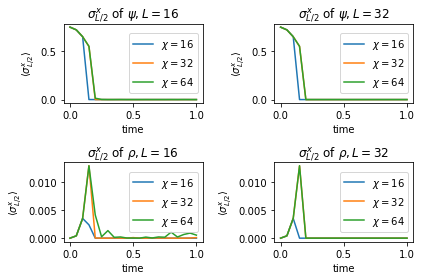

# Real Time Evolution

$\require{physics}$


```python
from copy import deepcopy

import numpy as np
import pandas as pd
from scipy.linalg import expm
import matplotlib.pyplot as plt
%matplotlib inline

from ph121c_lxvm import tensor, measure
```

## Summary

In this notebook, we will evolve a quantum state
\begin{align}
    \ket{\psi(t=0)} = \ket{\xi} \otimes \cdots \otimes \ket{\xi}
    ,
\end{align}
where $\ket{\xi} = \frac{1}{2} \left( \ket{\uparrow} - \sqrt{3} \ket{\downarrow} \right)$.
We will also evolve a second product state to compare against:
\begin{align}
    \ket{\psi (t=0)}
        &= \ket{\uparrow} \otimes \ket{\downarrow} \otimes \cdots
    .
\end{align}


```python
# Build initial state
down = np.array([1., 0.]).reshape(2, 1)
up   = down[::-1].reshape((2, 1))
ξ = (up - np.sqrt(3) * down) / 2

def make_waves (L, d):
    """Create the inital wavefunctions."""
    ψ = tensor.mps(L=L, d=d)
    ψ.from_arr([ ξ for _ in range(L) ], center=-1)
    assert (L % 2 == 0)
    ρ = tensor.mps(L=L, d=d)
    wave = []
    for i in range(L // 2):
        wave.append(up)
        wave.append(down)
    ρ.from_arr(wave, center=-1)    
    return (ψ, ρ)
```

We will do so while measuring the half-system entanglement entropy, $S_{L/2}$:


```python
def eentropy (tren, i):
    """Calculate the entanglement entropy at a cut between quanta i, i+1."""
    tren.groupby_quanta_tag([i])
    u, s, vh = np.linalg.svd(tren.center.mat)
    return measure.entropy.entanglement(s)

```

and these observables
$\ev{\sigma_{L/2}^x}, \ev{\sigma_1^x}, \ev{\sigma_{L/2}^z}, \ev{\sigma_1^z}$:


```python
sx = np.array([[0, 1], [1, 0]])
sy = np.array([[0, -1j], [1j, 0]])
sz = np.diag([1, -1])

def make_observables (L, d):
    """Create the observable operators of interest."""
    s1x = tensor.mpo(L=L, d=d)
    s1x.set_local_oper(sx, 1)
    sL2x = tensor.mpo(L=L, d=d)
    sL2x.set_local_oper(sx, L//2)
    s1z = tensor.mpo(L=L, d=d)
    s1z.set_local_oper(sz, 1)
    sL2z = tensor.mpo(L=L, d=d)
    sL2z.set_local_oper(sz, L//2)
    return (s1x, sL2x, s1z, sL2z)
```

We will consider the same Hamiltonian as before, now evolving in real time:


```python
# Build pieces of Hamiltonian in gate representation
def build_pieces_of_H (L, d, hx, hz):
    """Build the field, odd, and even term Hamiltonians and also their union."""
    H_field = np.empty(L, dtype='O')
    for i in range(H_field.size):
        H_field[i] = tensor.mpo(L=L, d=d)
        H_field[i].set_local_oper(-(hx * sx + hz * sz), i + 1)
    H_odd = np.empty(L//2, dtype='O')
    for i in range(H_odd.size):
        H_odd[i] = tensor.mpo(L=L, d=d)
        H_odd[i].set_local_oper(-sz, 2*i + 1)
        H_odd[i].set_local_oper(sz, 2*i + 1 + 1)
    H_even = np.empty(L//2 - 1 + L%2, dtype='O')
    for i in range(H_even.size):
        H_even[i] = tensor.mpo(L=L, d=d)
        H_even[i].set_local_oper(-sz, 2*(i + 1))
        H_even[i].set_local_oper(sz, 2*(i + 1) + 1)
    H_full = np.array([*H_field, *H_odd, *H_even], dtype='O')
    return (H_field, H_odd, H_even, H_full)


# Construct propagators
def build_propagators (L, d, δτ, H_field, H_odd, H_even):
    """Exponentiate each non-commuting piece of the Hamiltonian"""
    U_field = tensor.mpo(L=L, d=d)
    for i, e in enumerate(H_field):
        U_field.set_local_oper(expm(- 1.j * δτ * e[0].mat), i+1)
    U_odd = tensor.mpo(L=L, d=d)
    for i, e in enumerate(H_odd):
        U_odd.set_local_oper(
            expm(- 1.j * δτ * np.kron(e[1].mat, e[0].mat)),
            2 * i + 1
        )
    U_even = tensor.mpo(L=L, d=d)
    for i, e in enumerate(H_even):
        U_even.set_local_oper(
            expm(- 1.j * δτ * np.kron(e[1].mat, e[0].mat)),
            2 * (i + 1)
        )
    return (U_field, U_odd, U_even)


```

Our goal is to observe how quickly the entanglement entropy grows in time
in order to observe the limitations of the validity of our MPS approximation.

## Evolution

We will evolve the aforementioned states at the system sizes $L=16, 32$
for a fixed number $N=20$ of time steps at a step size of $\delta\tau=0.05$.
At each time step, we measure the entropy and the observables.

It would be nice to do a bigger system, but I already demonstrated that
my implementation can do these MPS systems up to a size of 100, albeit
slowly. I would need MOAR PERFORMANCE to consider letting these big
simulations run for bigger chunks time.

I wrote code that tried to be general, rather than specific.
I suppose there's a performance penalty for all of my argument checking.


```python
d = 2
hx = 1.05
hz = 0.05
δτ = 0.05
N = 20
```


```python
%%time
chi_vals = [16, 32, 64]
L_list = [16, 32]
# Data structure to save results
ψ_results = dict(t=[], L=[], S=[], s1x=[], sL2x=[], s1z=[], sL2z=[], chi=[])
ρ_results = dict(t=[], L=[], S=[], s1x=[], sL2x=[], s1z=[], sL2z=[], chi=[])
for L in L_list:
    for chi in chi_vals:
        H_field, H_odd, H_even, H_full = build_pieces_of_H(L=L, d=d, hx=hx, hz=hz)
        U_field, U_odd, U_even = build_propagators(
            L=L, d=d, δτ=δτ, H_field=H_field, H_odd=H_odd, H_even=H_even
        )
        ψ, ρ = make_waves(L=L, d=d)
        s1x, sL2x, s1z, sL2z = make_observables(L=L, d=d)
        ψ_results['t'].append(0)
        ψ_results['chi'].append(chi)
        ψ_results['L'].append(L)
        ψ_results['S'].append(eentropy(ψ, L//2))
        ψ_results['s1x'].append(s1x.expval(ψ))
        ψ_results['sL2x'].append(sL2x.expval(ψ))
        ψ_results['s1z'].append(s1z.expval(ψ))
        ψ_results['sL2z'].append(sL2z.expval(ψ))
        ρ_results['t'].append(0)
        ρ_results['chi'].append(chi)
        ρ_results['L'].append(L)
        ρ_results['S'].append(eentropy(ρ, L//2))
        ρ_results['s1x'].append(s1x.expval(ρ))
        ρ_results['sL2x'].append(sL2x.expval(ρ))
        ρ_results['s1z'].append(s1z.expval(ρ))
        ρ_results['sL2z'].append(sL2z.expval(ρ))
        for i in range(N):
            for e in [U_field, U_even, U_odd]:
                e.oper(ψ, inplace=True)
                e.oper(ρ, inplace=True)
            ψ.trim_bonds(chi)
            ρ.trim_bonds(chi)
            ψ.normalize()
            ρ.normalize()
            ψ_results['t'].append(δτ * (i + 1))
            ψ_results['chi'].append(chi)
            ψ_results['L'].append(L)
            ψ_results['S'].append(eentropy(ψ, L//2))
            ψ_results['s1x'].append(s1x.expval(ψ))
            ψ_results['sL2x'].append(sL2x.expval(ψ))
            ψ_results['s1z'].append(s1z.expval(ψ))
            ψ_results['sL2z'].append(sL2z.expval(ψ))
            ρ_results['t'].append(δτ * (i + 1))
            ρ_results['chi'].append(chi)
            ρ_results['L'].append(L)
            ρ_results['S'].append(eentropy(ρ, L//2))
            ρ_results['s1x'].append(s1x.expval(ρ))
            ρ_results['sL2x'].append(sL2x.expval(ρ))
            ρ_results['s1z'].append(s1z.expval(ρ))
            ρ_results['sL2z'].append(sL2z.expval(ρ))
            if ((i + 1) % 10 == 0):
                print(f'step {i+1} completed at L={L}, chi={chi}')
```

    step 10 completed at L=16, chi=16
    step 20 completed at L=16, chi=16
    step 10 completed at L=16, chi=32
    step 20 completed at L=16, chi=32
    step 10 completed at L=16, chi=64
    step 20 completed at L=16, chi=64
    step 10 completed at L=32, chi=16
    step 20 completed at L=32, chi=16
    step 10 completed at L=32, chi=32
    step 20 completed at L=32, chi=32
    step 10 completed at L=32, chi=64
    step 20 completed at L=32, chi=64
    CPU times: user 3h 18min 35s, sys: 2min 8s, total: 3h 20min 44s
    Wall time: 35min 49s


## Plots

Here we will plot all of the observables we have recorded 


```python
ψ_results['chi'] = []
ρ_results['chi'] = []
for L in L_list:
    for chi in chi_vals:
        for i in range(N+1):
            ψ_results['chi'].append(chi)
            ρ_results['chi'].append(chi)
```


```python
df = pd.DataFrame(ψ_results)
dp = pd.DataFrame(ρ_results)
```

Let's first show the entropies for different values of $\chi$


```python
nrow, ncol = 2, 2
fig, axes = plt.subplots(nrow, ncol)
for i, row in enumerate(axes):
    dd = [df, dp][i]
    names = ('psi', 'rho')
    for j, ax in enumerate(row):
        for k, chi in enumerate(chi_vals):
            which = (dd.L == L_list[j]) & (dd.chi == chi)
            ax.plot(
                dd.t[which].values, dd.S[which].values,
                label=f'$\\chi={chi}$'
            )
            ax.set_title('$S_{L/2}$ of $\\' + names[i] + ', L=' + str(L_list[j]) + '$')
            ax.set_xlabel('time')
            ax.set_ylabel('$S_{L/2}$')
            ax.legend(loc='right')
fig.tight_layout()
plt.show()
```


    

    


Seems like the entropies grow rapidly until they hit a peak.
What happens afterwards depends on the system size and $\chi$, but
it is clear that either the entropies saturate at some large value, or
they crash down violently to zero.

Now we can just make plots for each observable


```python
nrow, ncol = 2, 2
fig, axes = plt.subplots(nrow, ncol)
for i, row in enumerate(axes):
    dd = [df, dp][i]
    names = ('psi', 'rho')
    for j, ax in enumerate(row):
        for k, chi in enumerate(chi_vals):
            which = (dd.L == L_list[j]) & (dd.chi == chi)
            ax.plot(
                dd.t[which].values, np.real(dd.s1x[which].values),
                label=f'$\\chi={chi}$'
            )
            ax.set_title('$\\sigma_1^x$ of $\\' + names[i] + ', L=' + str(L_list[j]) + '$')
            ax.set_xlabel('time')
            ax.set_ylabel('$\\langle \\sigma_{1}^x \\rangle$')
            ax.legend(loc='right')
fig.tight_layout()
plt.show()
```


    

    


```python
nrow, ncol = 2, 2
fig, axes = plt.subplots(nrow, ncol)
for i, row in enumerate(axes):
    dd = [df, dp][i]
    names = ('psi', 'rho')
    for j, ax in enumerate(row):
        for k, chi in enumerate(chi_vals):
            which = (dd.L == L_list[j]) & (dd.chi == chi)
            ax.plot(
                dd.t[which].values, np.real(dd.sL2x[which].values),
                label=f'$\\chi={chi}$'
            )
            ax.set_title('$\\sigma_{L/2}^x$ of $\\' + names[i] + ', L=' + str(L_list[j]) + '$')
            ax.set_xlabel('time')
            ax.set_ylabel('$\\langle \\sigma_{L/2}^x \\rangle$')
            ax.legend(loc='right')
fig.tight_layout()
plt.show()
```


    

    


```python
nrow, ncol = 2, 2
fig, axes = plt.subplots(nrow, ncol)
for i, row in enumerate(axes):
    dd = [df, dp][i]
    names = ('psi', 'rho')
    for j, ax in enumerate(row):
        for k, chi in enumerate(chi_vals):
            which = (dd.L == L_list[j]) & (dd.chi == chi)
            ax.plot(
                dd.t[which].values, np.real(dd.s1z[which].values),
                label=f'$\\chi={chi}$'
            )
            ax.set_title('$\\sigma_1^z$ of $\\' + names[i] + ', L=' + str(L_list[j]) + '$')
            ax.set_xlabel('time')
            ax.set_ylabel('$\\langle \\sigma_{1}^z \\rangle$')
            ax.legend(loc='right')
fig.tight_layout()
plt.show()
```


    

    


```python
nrow, ncol = 2, 2
fig, axes = plt.subplots(nrow, ncol)
for i, row in enumerate(axes):
    dd = [df, dp][i]
    names = ('psi', 'rho')
    for j, ax in enumerate(row):
        for k, chi in enumerate(chi_vals):
            which = (dd.L == L_list[j]) & (dd.chi == chi)
            ax.plot(
                dd.t[which].values, np.real(dd.sL2z[which].values),
                label=f'$\\chi={chi}$'
            )
            ax.set_title('$\\sigma_{L/2}^z$ of $\\' + names[i] + ', L=' + str(L_list[j]) + '$')
            ax.set_xlabel('time')
            ax.set_ylabel('$\\langle \\sigma_{L/2}^z \\rangle$')
            ax.legend(loc='right')
fig.tight_layout()
plt.show()
```


    

    


I'm rather surprised there isn't as much oscillation as in the last
homework, but I checked that one I evolved for 40 seconds and here it is only 1.
In each case, the observables crash down to zero wherever the entropy
peaks.
It's really almost too obvious.
It seems like my solver is failing drastically instead of just making a poor approximation.

Anyway, the results seem to match for both test wavefunctions, so at least
the simulations are consistent.


```python

```
